Date: 2019-06-18 18:53 
Author: Andrew Trick 
Title: Chicago Crime Presentation
Slug: cc_pres
status: hidden

Below are the slides from the final presentation for SNHU capstone project, 'Forecasting Chicago Crime' by Andrew Trick. 
PDF version is downloadable here: <a href="../img/cc_pres/chi_crime_pdf.pdf">PDF version</a>.
 
 
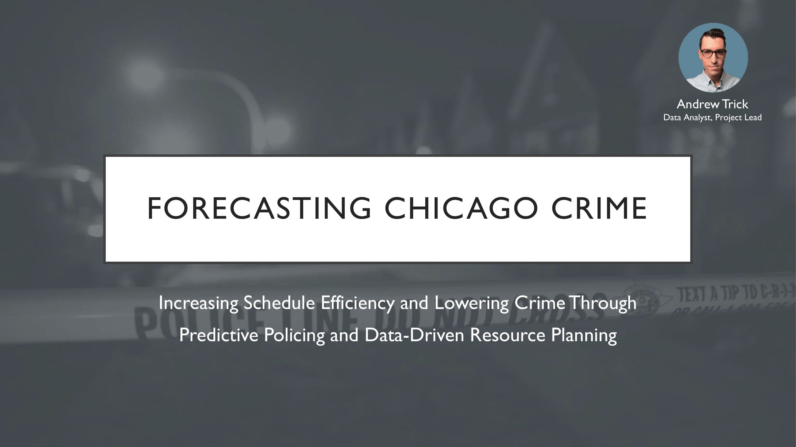 

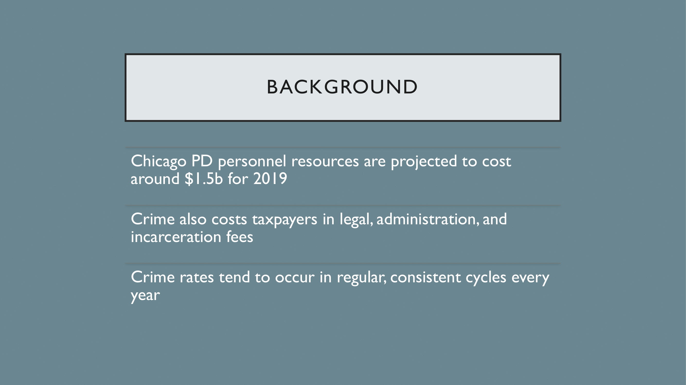 

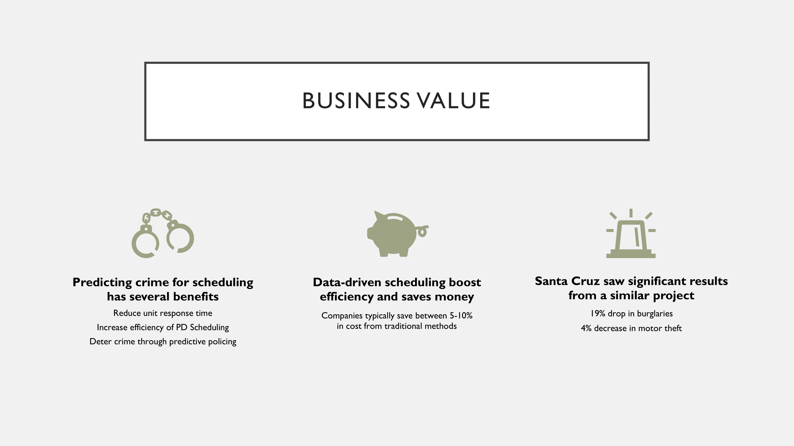 

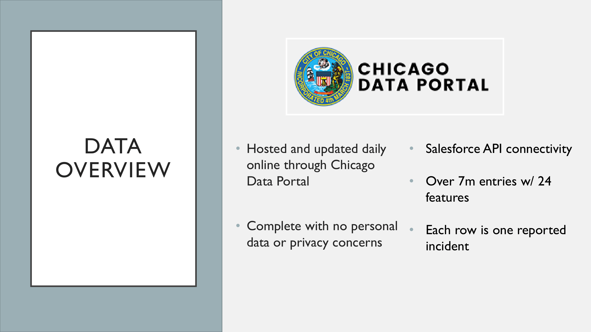 

 

 

 

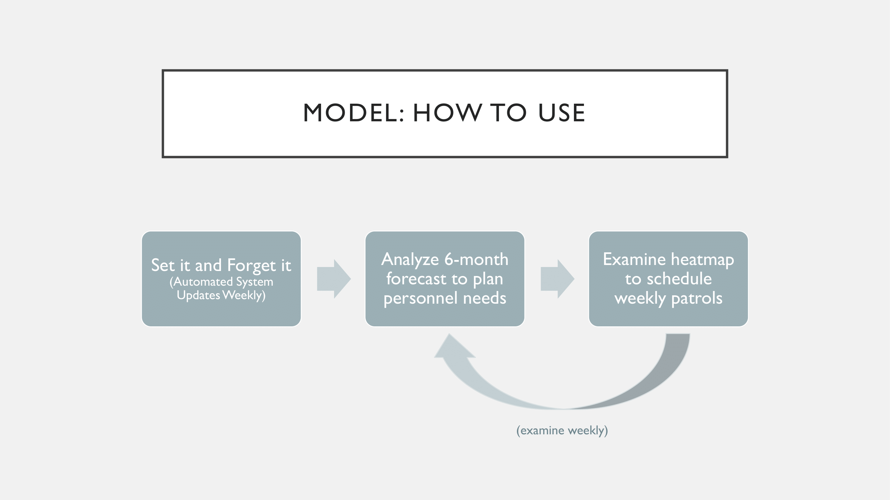 

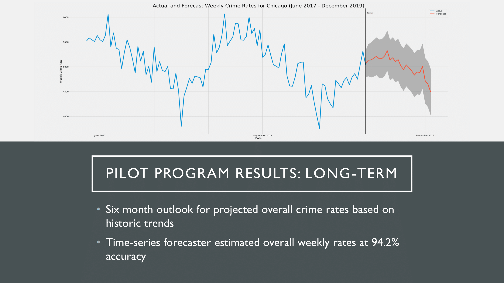 

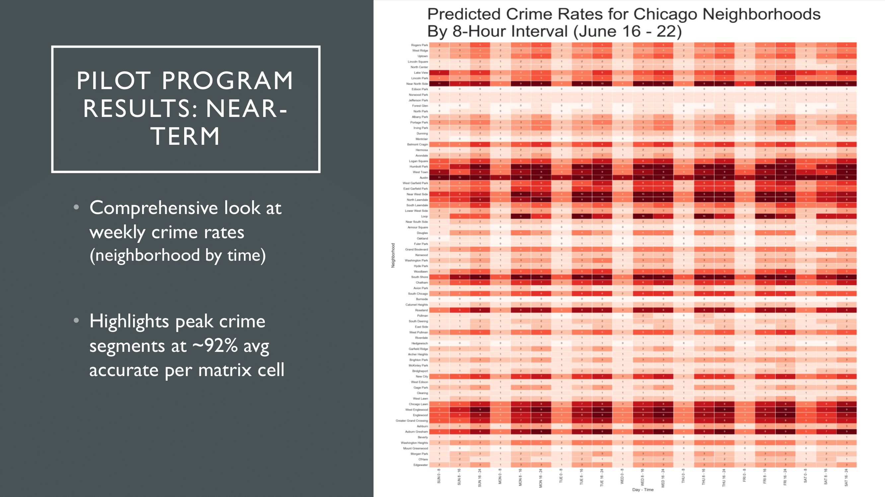 

 

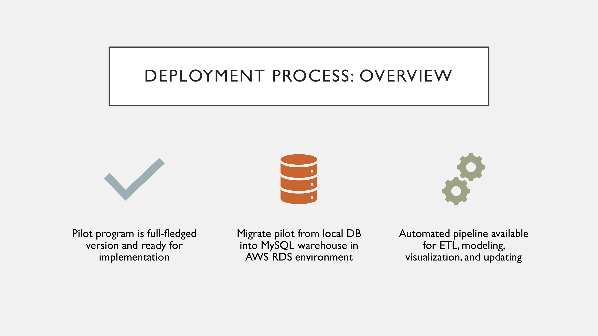 

 

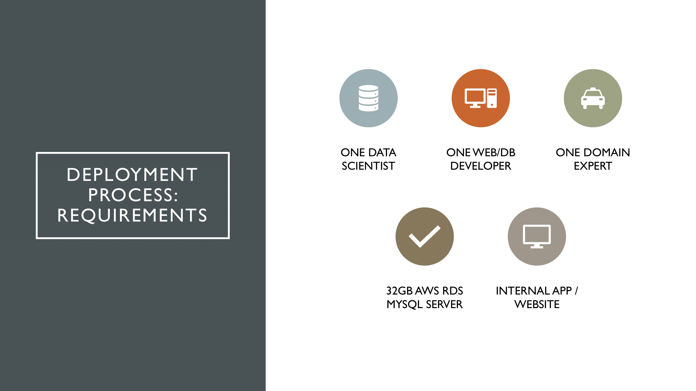 

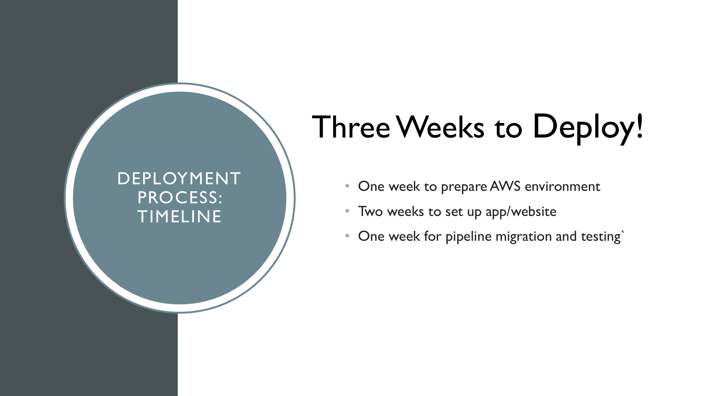 

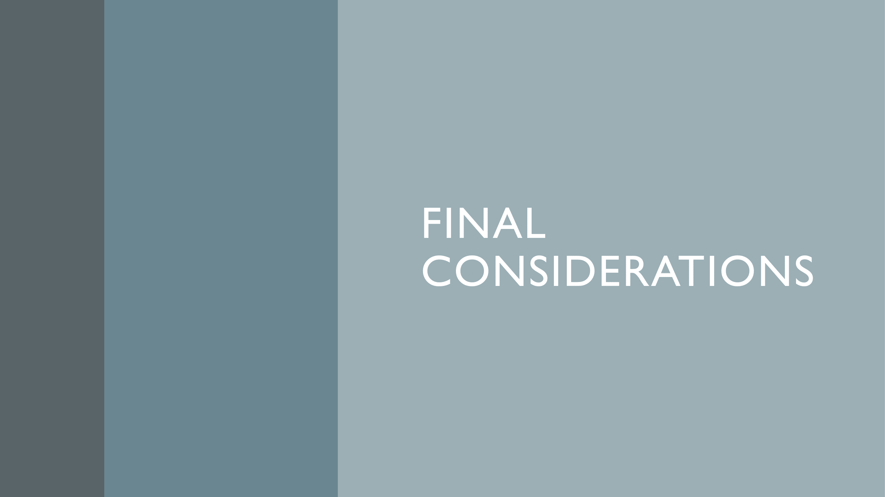 

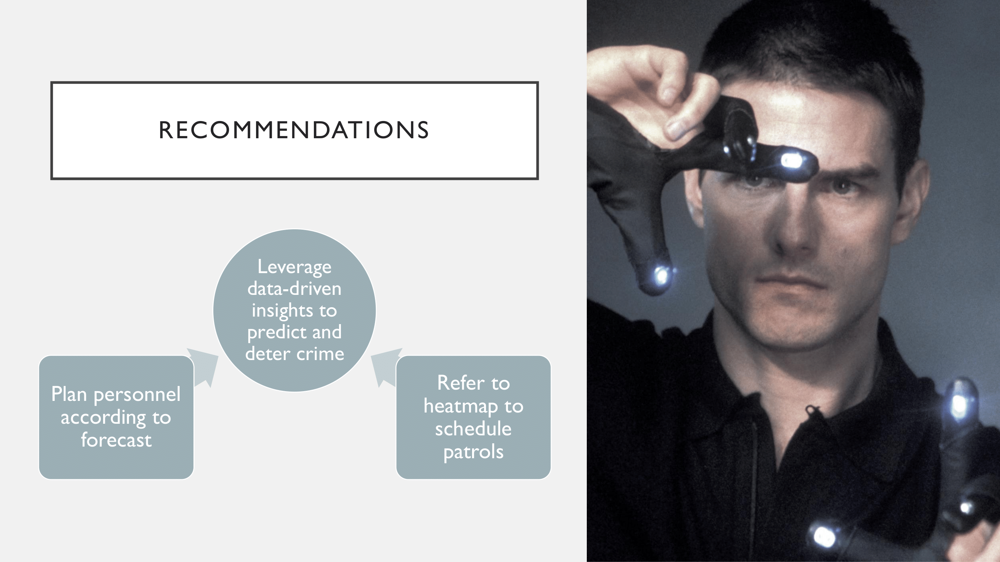 

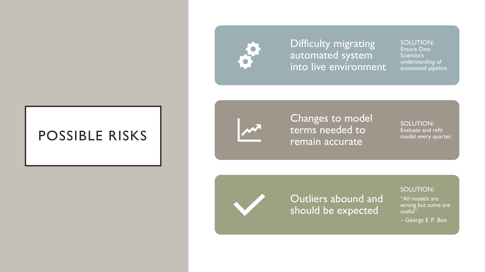 

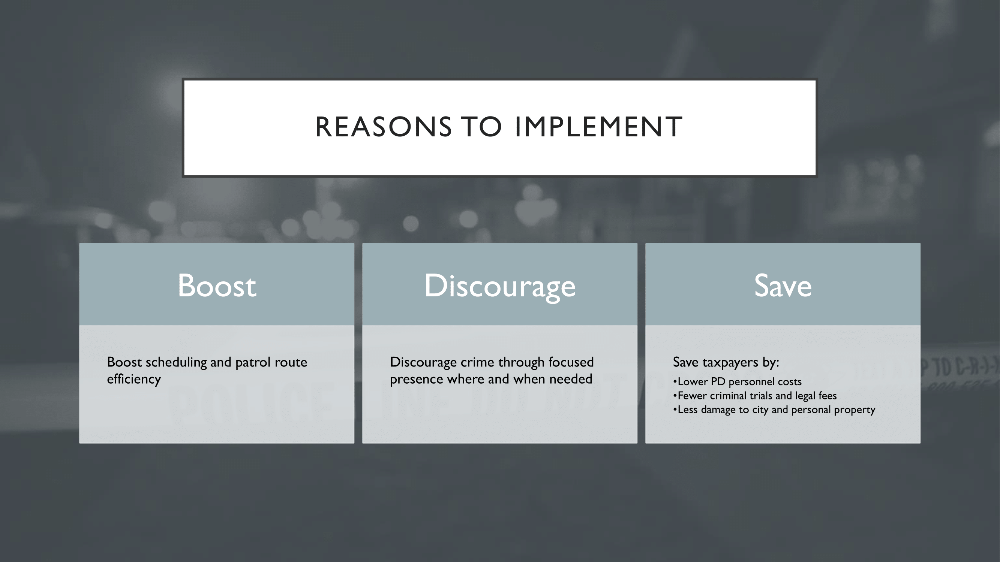 

 

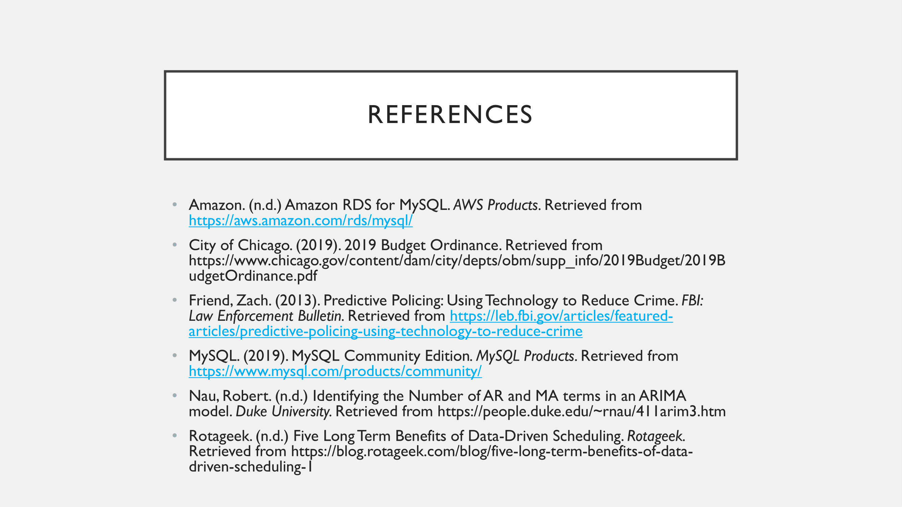 