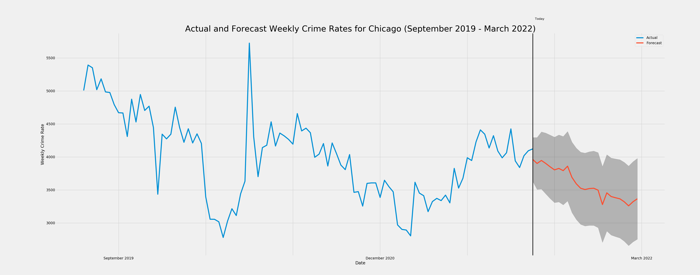
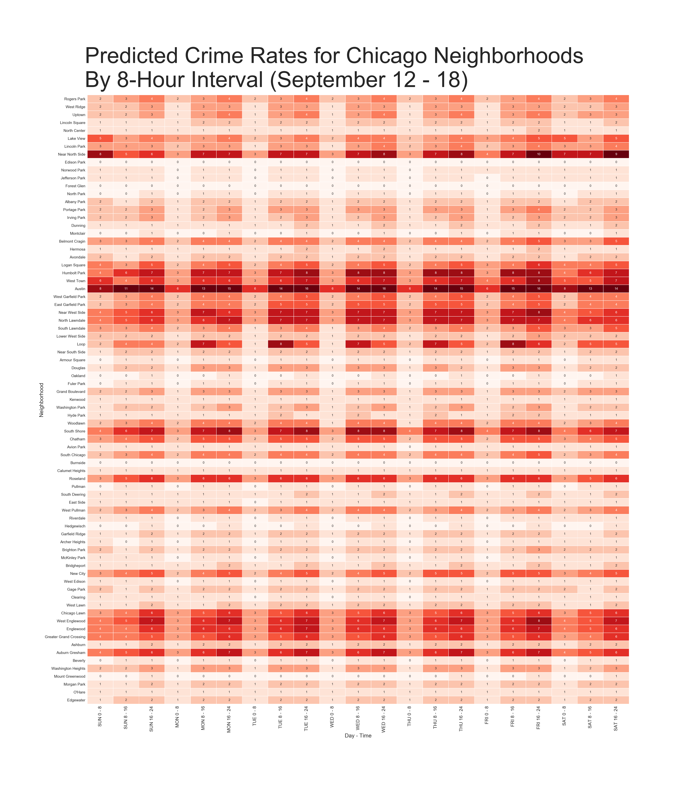

Date: 2019-06-12 18:53 
Author: Andrew Trick 
Title: Chicago Crime

### Weekly Time-Series Forecast
This is a crime rate forecaster for the City of Chicago. It predicts overall weekly occurrence rates and maps them out to their expected distribution across city neighborhood and time grouping (8-hour intervals). 
  
It uses a SARIMA time-series forecast, detailed <a href="../crime_forecaster.html">here</a>, trained on data obtained from Chicago's <a href="https://data.cityofchicago.org/">Data Portal</a>. Evaluation in training resulted in an accuracy of 94.2%, with a mean error per location-time matrix element of 0.2.
  
Data, model, and visualizations are updated through an automated system, lightly detailed in a post <a href="../auto_etl_pipeline.html">here</a>. 
  
This will be updated every Sunday. 

&nbsp;&nbsp;&nbsp;&nbsp;&nbsp;&nbsp;&nbsp;&nbsp;&nbsp;&nbsp;&nbsp;&nbsp;Or view a larger version of the <a href="../img/chi_crime/6m-forecast.png" target="_blank">Forecast</a>.
   

&nbsp;&nbsp;&nbsp;&nbsp;&nbsp;&nbsp;&nbsp;&nbsp;&nbsp;&nbsp;&nbsp;&nbsp;Or view a larger version of the <a href="../img/chi_crime/pred_matrix.png" target="_blank">Prediction Matrix</a>.