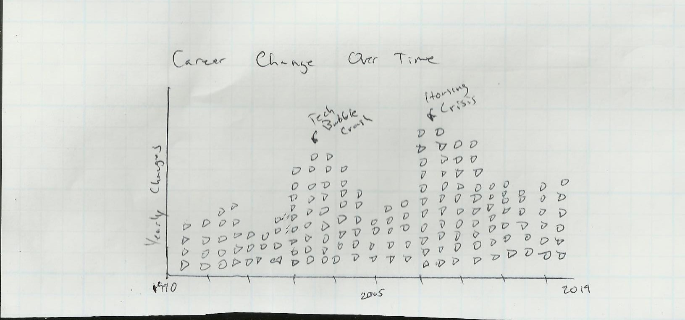
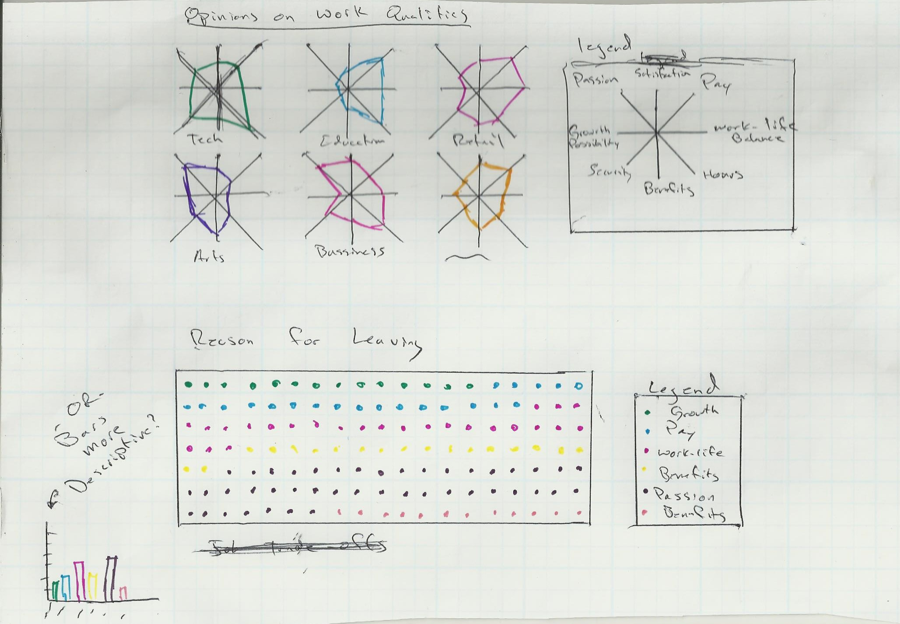
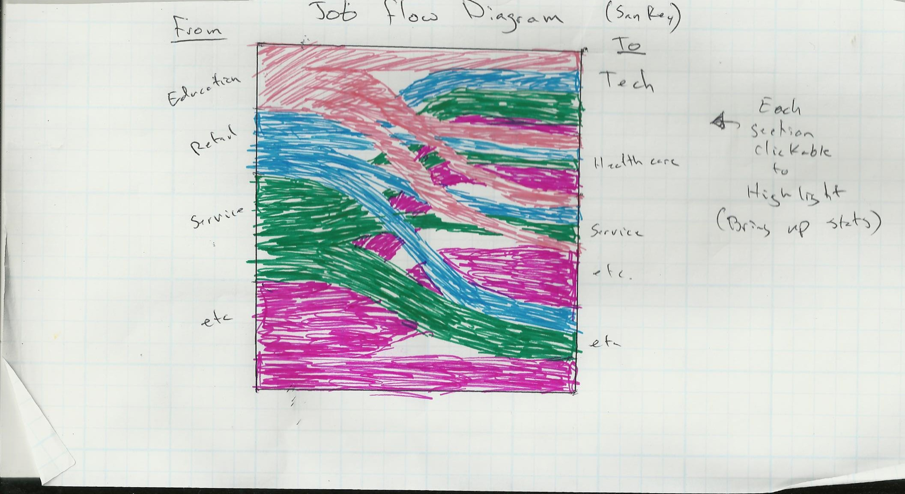
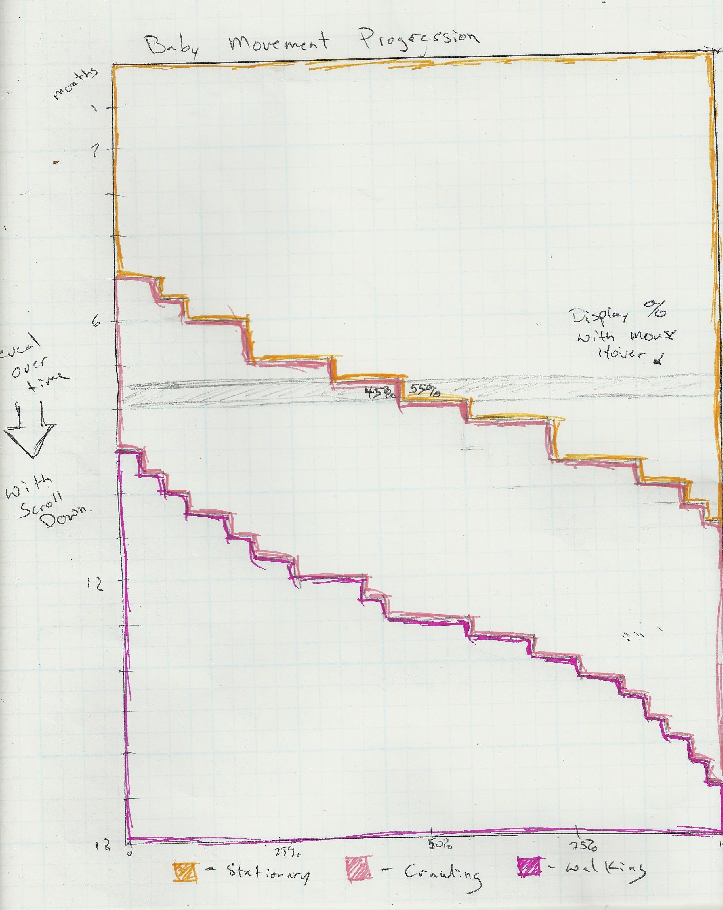
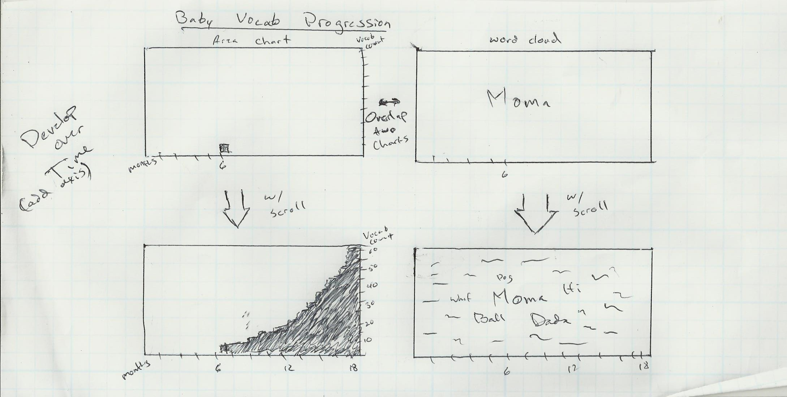
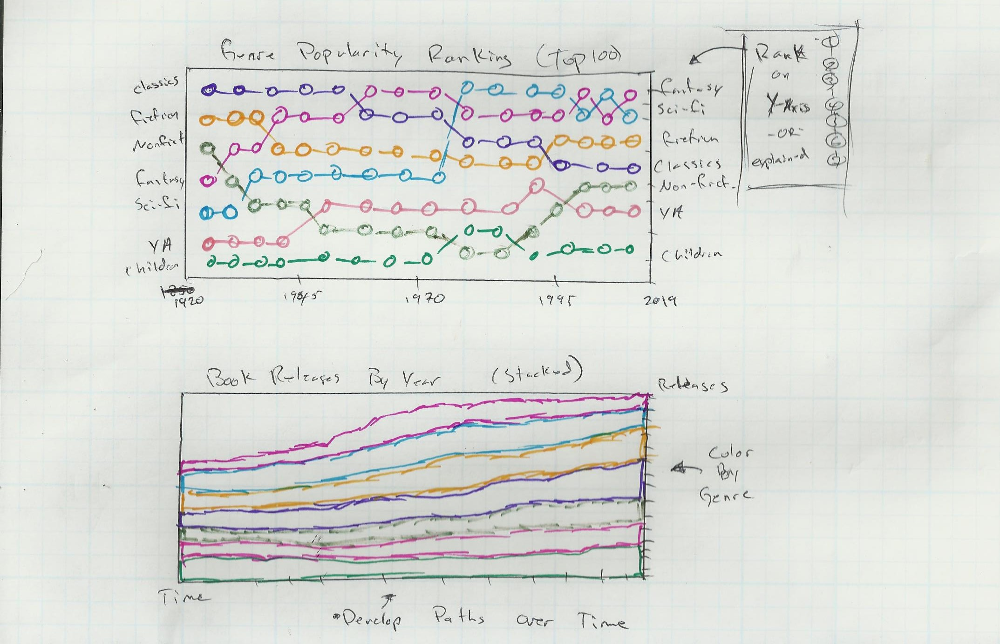
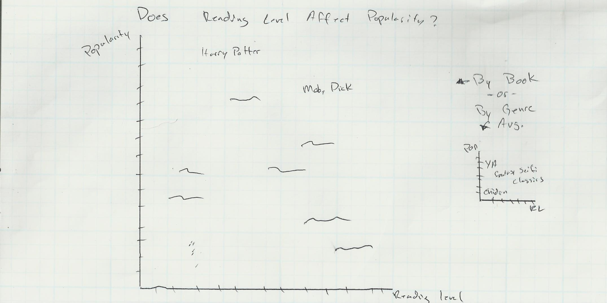
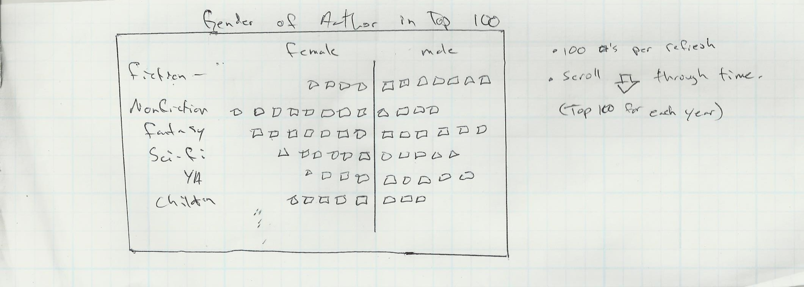

Date: 2017-09-04 18:53 
Author: Andrew Trick 
Title: Ideas for Pudding Cool
Slug: Pudding
status: hidden

Thanks for visiting! As you guys at The Pudding know, visuals can convey an idea much more quicker and simpler than words. With this in mind, here are some quick sketches of possible visuals for each of the stories I suggested:  
 
 
### Career Change - Why and How
 
 

 

 

##### Considerations
- Where to source data? 
- Is it really that interesting or are the trends obvious?
- Is there a better choice to show flow than a sankey?
- How much do career change statistics vary with recessions (any correlation to recession length?)
 
 
### Baby Milestones, Visualized
 
 

 

##### Considerations
- Do any resources track this data?
- Movement milestones split further than only crawling and walking?
- Is there a difference based on number child?
 
 
### Literary Genre Trends
 
 

 

 

##### Considerations
- Could goodreads.com API be used for this?
- How to best specify 'popular' - sales? ratings? review count on goodreads?
- Is there a way to source reading level for books?
- If using Goodreads API, is it biased?

