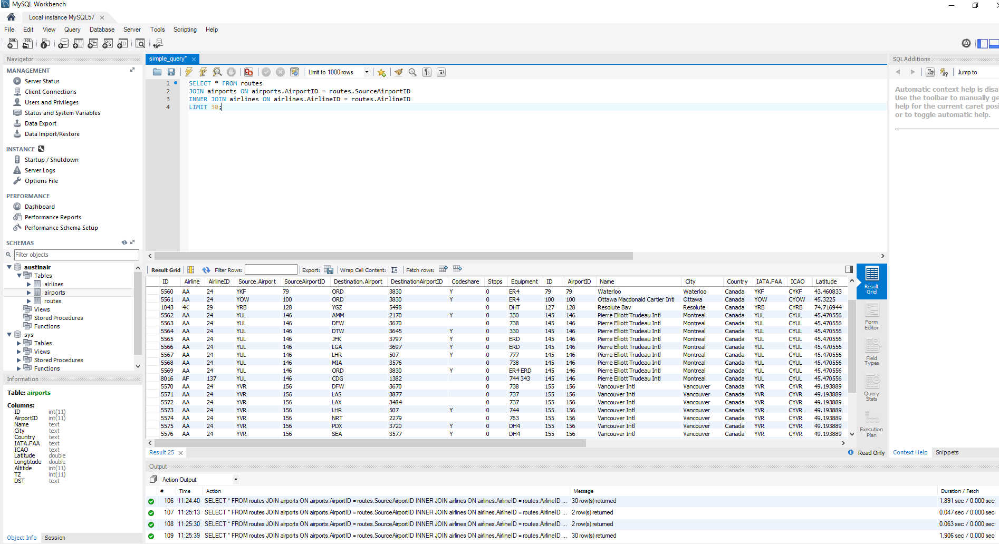
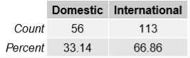
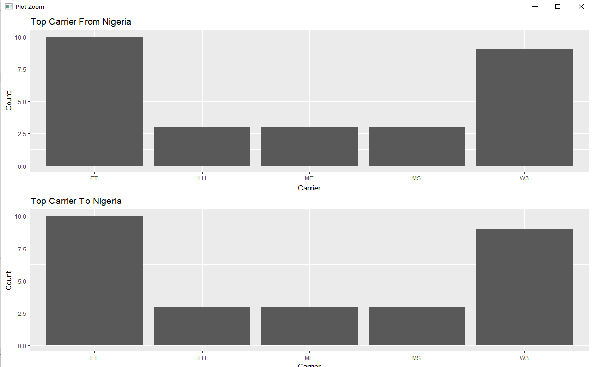
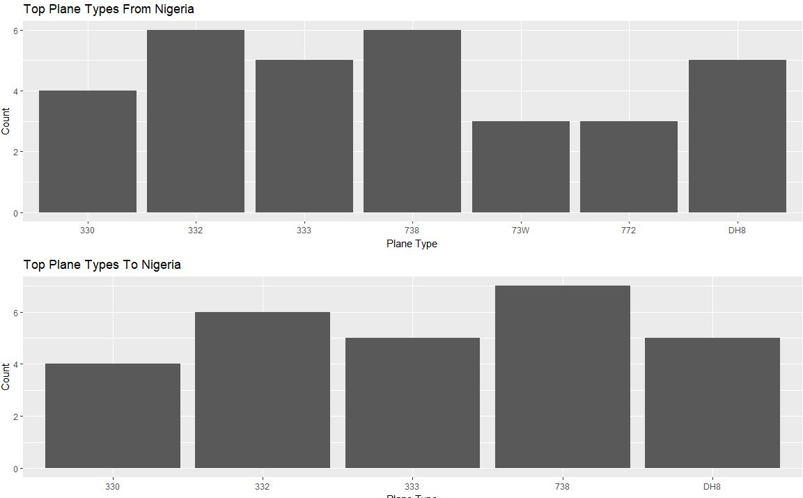
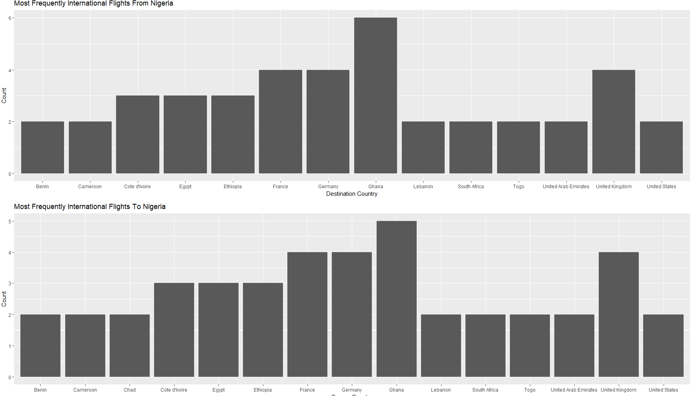
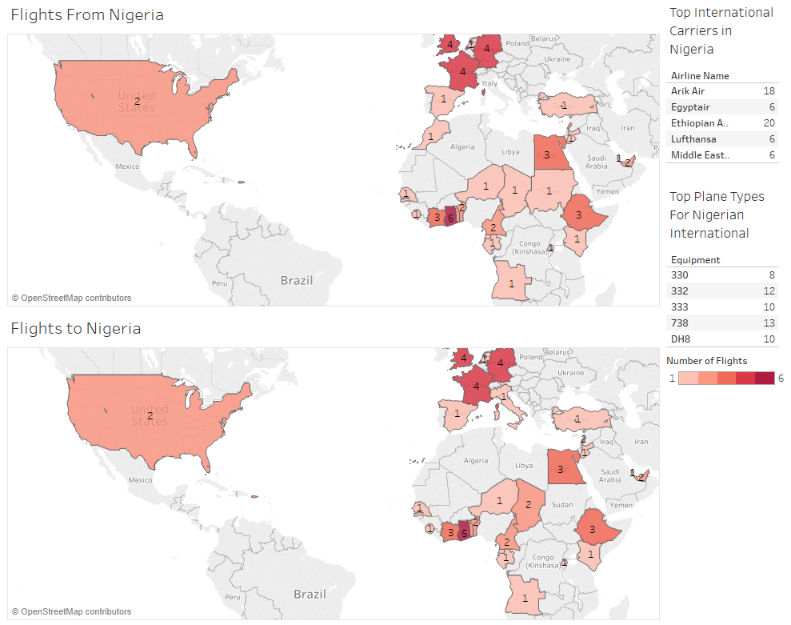
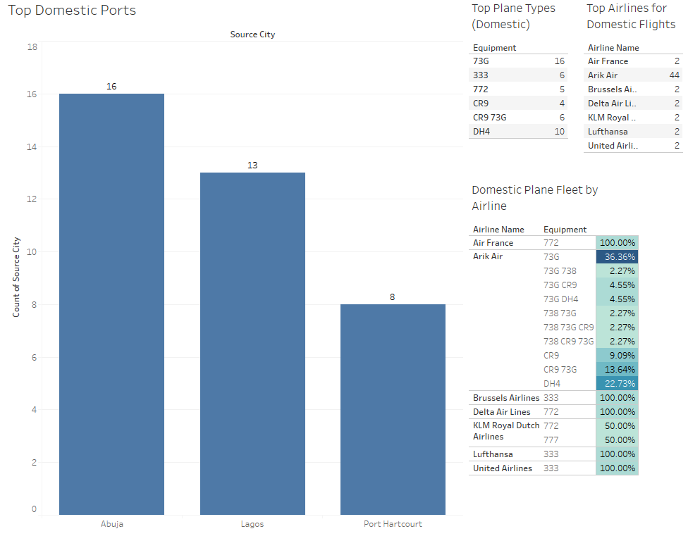
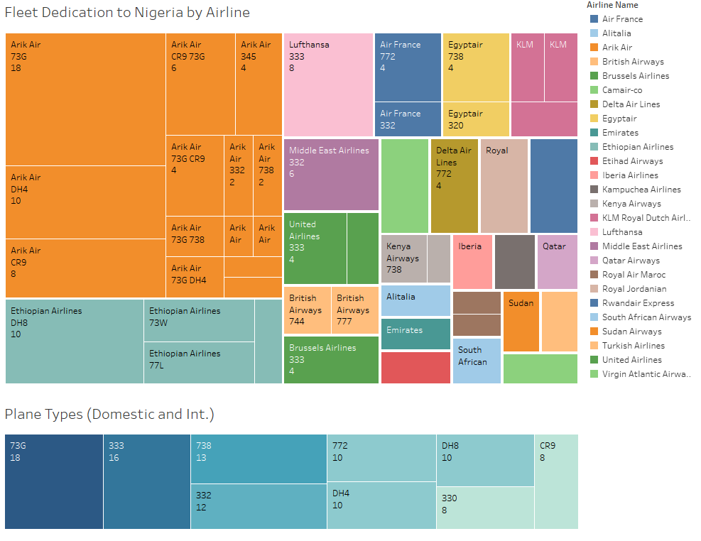

Date: 2018-04-22 08:53 
Author: Andrew Trick 
Title: Nigerian Airline Frequency Analysis
Name: Nigerian Airline Frequency Analysis
Category: Exploratory Data Analysis
Tags: modeling, reporting, dashboard, r, SQL, tableau, cleaning
Summary: A summary report of work I did for a Data Analytics II course at SNHU. Fictional company, Austin Air, is looking to enter the international airline industry with a goal of capturing a significant market share of business focused around Nigeria. Analysis will provide a look at the current industry and suggest strategies towards implementing a pilot program for the company to introduce to the market and achieve their goal. 

Housed below is a summary report of work I did for a Data Analytics II course at SNHU. Fictional 
company, Austin Air, is looking to enter the international airline industry with a goal of capturing 
a significant market share of business focused around Nigeria. Available data was examined and a data
analysis life-cycle plan was created. Three datasets were of particular interest, and these could be 
connected via unique identifiers. As over 90% of the data within the datasets were categorical, a frequency
analysis approach was used to discover trends within the industry. 
   
**Process** 
I initially imported the data into R and used this program to clean and explore the data. Once cleaned,
the data were written out and stored into a relational format via a MySQL database. I then utilized ggplot2
in R to create the presentation visuals, while using Tableau to create three dashboards- each one with a particular
flight segmentation focus. Additionally, JMP was used occasional to perform some quick statistical tests when needed. 
 
Once visuals were created, results were detailed on in the summary report to indicate suggested business strategies for
the company. Although a lack of time-series knowledge largely hampered the possibilities of analysis, three particular
findings are focused on which could be leveraged by Austin Air. I believe the insights determined through this analysis
can start Austin Air on the correct path towards achieving their goals.
   
All data and working files can be found on my <a href="https://github.com/leaflettuce/AustinAirAnalysis" download>github</a>  
 
 

**Austin Air Analysis - Summary Report _(Partial)_** 

[**Abstract**]()

Austin Air is seeking to capture
a significant portion of the Nigerian airline industry away from the currently
dominate European companies. The following summary report provides a look at
the current status of the Nigerian airline industry and leverages historic data
to suggests an appropriate strategy for Austin Air to enter the market. Frequency
analysis has specified three specific business strategies in particular for
Austin Air to implement towards achieving their goals. Firstly, Austin Air
should initially invest into only three specific plane types: 73G, A333, and
DH8. A suggested distribution of these plane type for the company’s initial
fleet is also included below. Secondly, the report suggests locations, domestic
and international, which should be included in the beginning, pilot program for
Austin Air. Lastly, analysis designates two airliners, Arik Air and Ethiopian
Airlines, as direct competitors and proposes further avenues of research
towards leveraging this knowledge positively for Austin Air. Utilizing the
data-driven insights highlighted throughout this report, Austin Air can
efficiently and effectively achieve their goal of capturing a signification
portion of the Nigeria air travel industry.

## [Data Processing]()

### [Collection Methods and Integration Tactics]()

The data utilized throughout this project was a collection
of airport, airline, and air-route information sourced in January 2012. This
data was obtained by Austin Air and provided to the team for processing and
analysis. Although no collection time-frame was indicated, one assumption can
be made based upon size of the air-routes dataset: The data accounts for no
more than a few days’ worth of flight route information. This can be implied
from the number of flights to and from each airport in the dataset. 

            Integration
of the data revolved around connecting the airline and airport data to the
routes dataset, which contained both an airline ID and an airport ID. Joining
via these identifiers resulted in a unified version of the data with all
necessary information connected and accessible. R dataframe merging techniques
were utilized to complete this step for exploratory data analysis, while SQL
foreign keys were used to connect the data within a relational database as well.

 

### [Data Enrichment Processes]()

#### [Missing Values]()

Data enrichment began with cleaning the data. This first
step, even before integration, was to check for missing values to either impute
values for or remove. ~1,194 rows were missing the necessary connector variables
of either airline ID or airport ID. It was determined that there was no acceptable
method to figure correct values and, instead of possible introducing errors
into the analysis, these rows were removed. As these rows account for only 2%
of the data and no rows directly relate to Nigerian airports, it was an
acceptable choice to omit. Outside of ID values, few other rows required
editing. Although there were numerous IATA/ICAO codes missing, these were unnecessary
for the goals of this analysis, and therefore ignored. 

#### [Subsetting]()

After cleaning, the data were integrated together and
subset. As Austin Air’s goals all focus upon the Nigerian air-travel industry, data
was subset to encompass only routes which included a Nigerian airport as its
source and/or destination. This allowed analysis to convey the trends seen specifically
within the Nigeria market- including routes from Berlin to New York, for
example, would be not only useless, but detrimental to analysis of the Nigerian
market. This Nigerian subset was then subset three more times during EDA to
provide a more granular look at domestic v. international (from Nigeria) v.
international (to Nigeria) flights.

#### [Feature Generation]()

            Finally,
new features were generated to facilitate frequency analysis techniques. The
primary variables of interest are plane types, destination/source airports, and
airlines. Each of these variables had a ‘count’ variable created and added to
the dataset to promote easy exploratory analysis in R. Although nonstop v connecting
variables were expected to have provided information relevant to scheduling flight
routes for Austin Air, a quick look indicated that there were only 24
connecting flights in the dataset (&lt;.01%). As such, this course of analysis was
scraped for lack of data.

 

### [Data Positioning]()

Once cleaning, feature generation, and preliminary analysis were
conducted, data were then stored into a relational database. R was used to
split and rewrite the data into three organized and cleaned csv files:
airports_cleaned, airlines_cleaned, and routes_cleaned. Although MS SQL Server
was initially planned for storage, unforeseen circumstances (virtual
environment downtime) required the use of MySQL (w/ Workbench) instead. 

&nbsp;&nbsp;&nbsp;&nbsp;&nbsp;&nbsp;  

As seen above, a query was used
after data insertion to confirm proper storage and alignment of the data. All
relevant data to this analysis are held within the ‘AustinAir’ database, and
each route can be connected to appropriate airline and airports via calling on
foreign key identifiers.

 

## [Results]()

As expected by the analysis team, both time-series and
regression analysis were not practical considering the data available.
Time-series modelling was out due to the lack of any type of time variables, while
even a naïve model is impossible due to the lack of knowledge regarding the
time-frame of collection. Rather than predict needed fleet size by estimating
flight volume for a time-period as planned, the approach was changed and
focused instead on figuring plane type distribution of the fleet based upon
competitor airlines. Similarly, regression techniques are most applicable when
predicting some base numeric dependent, which was also lacking in the available
data. Since over 90% of the variables recorded are categorical, frequency
analysis was determined as the best route to achieving useful results from
analysis. 

 

### [Visualization Strategies]()

Relating results from frequency analysis hinges on creating
informative and easily understood tables and histograms. Utilizing two
different visualization methods, Austin Air stakeholders and management can be
presented with visuals which convey: the appropriate fleet size to invest in,
the top competitors in the market, and locations which should be included in
the initial phases of the pilot program. The two visualization methods utilized
to relate analysis results are a presentation and a dashboard.

#### [Presentation]()

Although Austin Air is looking to venture into the
international market, the domestic consumer can not be forgotten. About 1 in 3
travelers in the Nigerian airline market are domestic flyers.

&nbsp;&nbsp;&nbsp;&nbsp;&nbsp;&nbsp;  

Although most of the presentation
focuses on international trends and patterns, major domestic routes between
Nigerian airports should be considered by Austin Air as well so as not neglect
1 out of every 3 fliers.

            Charts
relating international distributions are split into two different histograms:
One representing flights _into_ Nigeria
and one representing flights _from_
Nigeria. The first chart is a look at the top international competitors to
Austin Air.

&nbsp;&nbsp;&nbsp;&nbsp;&nbsp;&nbsp;  

Ethiopian Airlines and Arik Air are
the airlines consumers typically chose for international travel to and from
Nigeria. Therefore, these two companies should be considered Austin Air’s
primary competition.

            The
next look is the distribution of the top plane types flying to and from Nigeria.

&nbsp;&nbsp;&nbsp;&nbsp;&nbsp;&nbsp;  

As seen above, international flights
are typically on: 738’s; 330, 332, and 333 Airbuses; and Bombardier Dash 8s. Although
domestic is considered additionally in the dashboard below, this chart
indicated that investment into these plane types would be valuable for international
routing. 

            Next
for the presentation is a histogram of countries of interest for Austin Air.

&nbsp;&nbsp;&nbsp;&nbsp;&nbsp;&nbsp;  

Ghana, Germany, France, and the United
Kingdom top the charts in Nigerian international travel. These plus the next
three top popular routes (Egypt, Cote D’Ivoire, and Ethiopia) account for 46%
of all International air travel connected to Nigeria.

            Lastly,
JMP provides an interesting look of two connected histograms. The display below
represents the connection between source and destination airports of Nigerian air
travel. We can see that Mutala Muhammad International Airport sees the most
flights, both incoming and outgoing, for the Nigerian air travel market. As
such, this location should be the home base for Austin Air. This airport
accounts for about 32% of all flights connected to Nigeria while also having a
very wide spread of connecting airports (~80%)- seen by the highlighted
airports on the left frequencies list.

&nbsp;&nbsp;&nbsp;&nbsp;&nbsp;&nbsp;  

#### [Dashboard]()

Tableau dashboards have also been created for use by Austin
Air stakeholders and management to explore at their own pace. Three dashboards
split up information that is of interest to Austin Air. Although much of this
data is another view at the findings represented in the presentation, this provides
a second, segmented perspective for the audience to fully grasp the results of
analysis. The first dashboard examines international data:

&nbsp;&nbsp;&nbsp;&nbsp;&nbsp;&nbsp;       

The dashboard includes hover
tooltips to provide context and further information on the country, city, and
airport names to and from Nigeria. Top airline competitors and plane types for
these routes are also included on the right-hand side.

            Similarly,
domestic information is broken down and evaluated on the next dashboard:

&nbsp;&nbsp;&nbsp;&nbsp;&nbsp;&nbsp;  
        

Instead of a map, the primary image
is a histogram of the top cities of popularity for domestic Nigerian flights. Domestic
flights, as indicated above, represent 33% of all air travel in Nigeria, while
these three cities account for 66% of that domestic travel. The lower costs of domestic
flights can also help facilitate lower prices for international travelers as
well. The bottom-right table displays the distribution of plane types for domestic
flights, split by airline. Arik Air holds a dominate share of the market, and a
similar fleet distribution for Austin Air’s domestic wing could be effective.

            Lastly,
a dashboard examining an aggregate of domestic and international data:

&nbsp;&nbsp;&nbsp;&nbsp;&nbsp;&nbsp;  
 
+
Although a bit more time consuming
to take in, the primary visual of this dashboard represents a look at plane
type distributions of each major airlines Nigerian flights (flights which
include Nigeria- both domestic and international). Again, it is seen that Arik
Air and Ethiopian Airlines currently control a large portion of the country’s air
traffic. Additionally included are the top 9 plane types (in aggregate) used
for Nigerian air routes. 

 

### [Suggestions to Austin Air]()

With analysis complete, the value of the project can be
examined with Austin Air’s overall goals in mind. The objectives of the project
were to: 

·        
Determine the busiest Airports typically linked
to Nigerian airports.

·        
Decide how many of each plane type to initially
invest into.

·        
Discover which routes should be direct, and
which should be connections.

Although the latter objective was
impossible due to a lack of data, the two former goals can be directly answered
from the results of this analysis. Additionally, the team can also evaluate top
competition currently in the market. A three-pronged business strategy for
Austin Air follows which will help the company leverage these data-driven
insights towards achieving its overall goal of capturing a significant portion
of Nigerian air travel.
 
#### [Suggested Distribution of Fleet]()

Although precise numbers cannot be determined due to lack of
time reference of data collection, Austin Air should invest into a fleet with
the following distribution of plane types:

            -27%
// 73G (Boeing 737-700) 

            -55%
// A333 (Airbus 330-300)

            -18%
// DH8 (Bombardier Dash 8)

A distribution like this promotes a
focus of international travel without neglecting the revenue possible from
domestic flight service. The 73G’s should be prioritized towards domestic
flights, with one or two A333’s also devoted to domestic service as needed. The
majority of the A333 division should be the primary mode of international
travel. DH8’s- a smaller plane type- should be utilized towards the less busy
international routes. Contact with the original data collectors to obtain the
time-frame of the survey can provide a lead on the precise numbers these
distributions relate to.
 
#### [Ports of Interest]()

Domestic service should primarily focus on Abuja, Lagos, and
Port Hartcourt as these account for about 21% of all Nigeria air traffic (66%
of the domestic). Countries which should be included in the beginning phase of Austin
Air’s international services are: Ghana, Germany, France, UK, Egypt, Ethiopia,
and Cote D’Ivoire (Ivory Coast). These seven countries account for 48% of
international traffic to and from Nigeria. Overall, the ten locations listed
above account for 52% of all flight to and from Nigeria. With a home-base of
Mutala Muhammad International Airport, Austin Air would also have direct, one-way
flight access to each of these locations. 
 
#### [Focus Marketing Against Direct Competitors]()

Lastly, Austin Air should conduct marketing competitor
analysis to determine the strengths and weaknesses of its two top competitors:
Arik Air and Ethiopian Airlines. Analysis results indicate that these two
companies hold an extreme majority of the Nigerian air travel market share,
both domestic and international. Successfully leveraging this knowledge can
lead to finding strategies in which to outperform these two companies in price
and customer expectations. Further, it could also hint at avenues to
aggressively advertising against each company. 

Each of these suggestions to Austin Air provide a strong
launching point for the pilot program of the company. With further in-house
data collection and analysis as the company grows, Austin Air will be able to follow
the trends and insights found from big data analytics and utilize them towards making
informed decisions while expanding the business. Following this route, Austin
Air will not only start strong, but could quickly become the number one airline
for Nigeria air travel and a large contender in the worldwide industry.