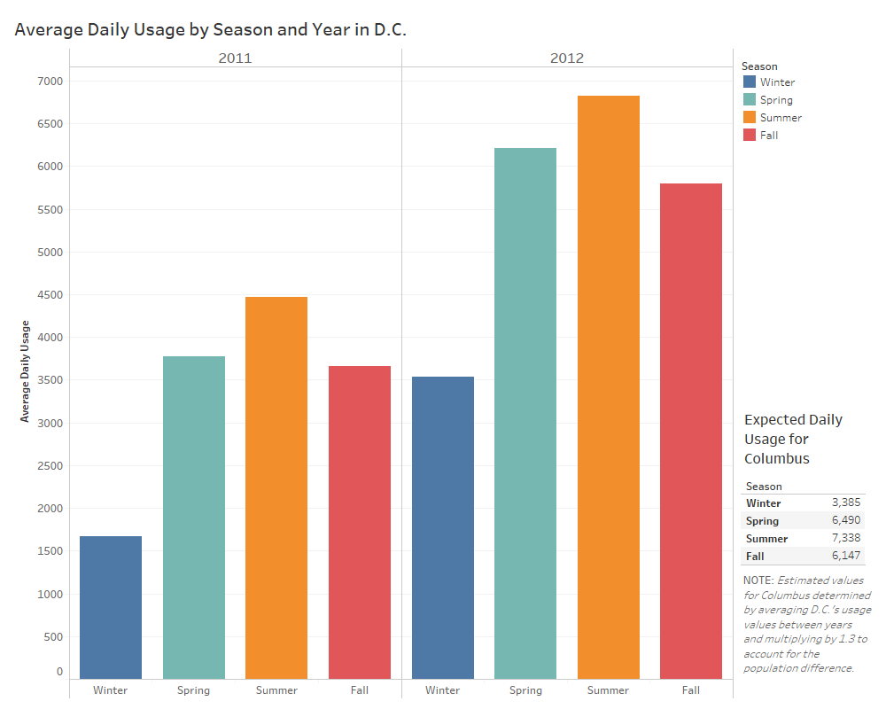
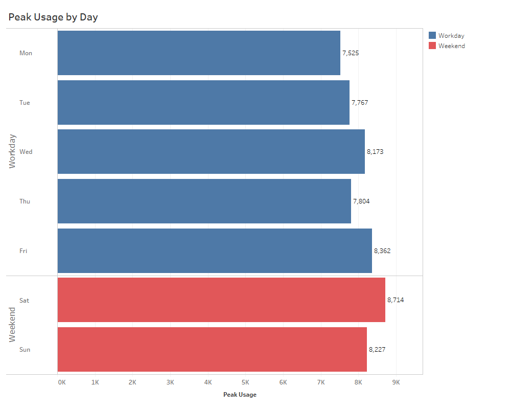
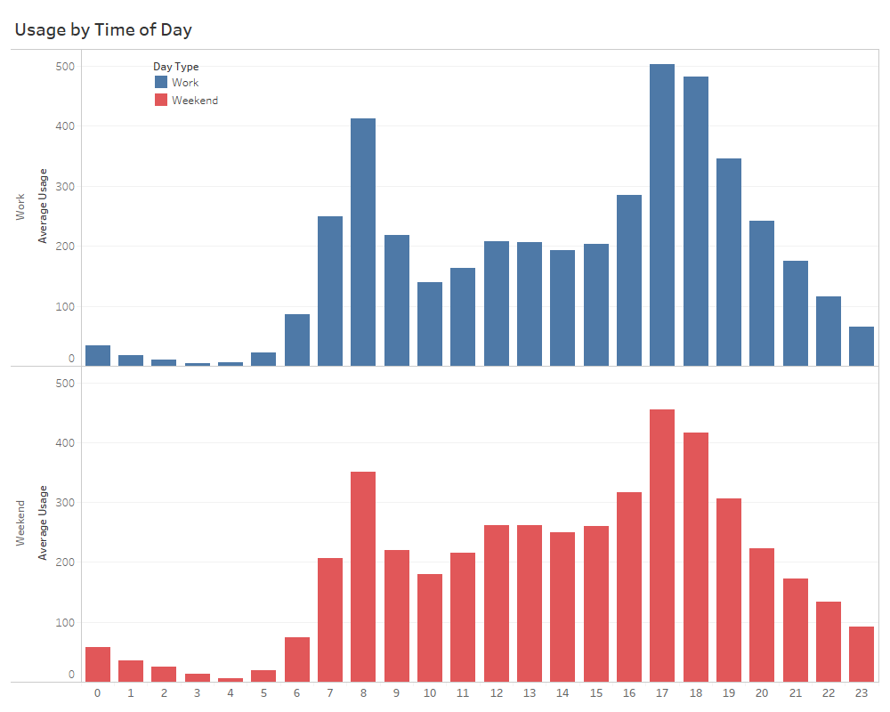
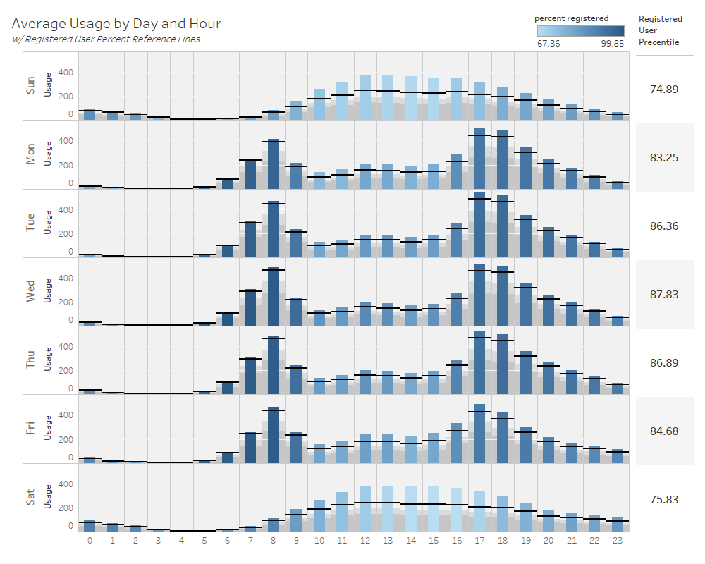
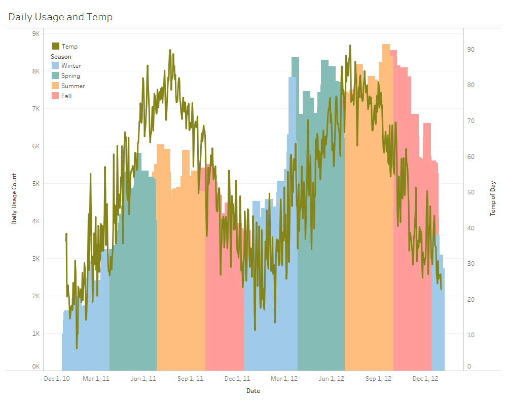

Title: Visualizing Bikeshare Data
Slug: DC_Bikeshare
Date: 2018-05-19 14:00
Category: Data Visualization
Tags: EDA, visualizing, Tableau, reporting
author: Andrew Trick
Summary: A few visuals I created in Tableau displaying some findings within the D.C. bikeshare program. Data accounts for the program during the 2011-12 years and aggregates usage by day and by hour. Project was originally conducted as homework for my Decision Support Presentation course at SNHU. The final goal of analysis was to create visuals which accurately and efficiently represented usage information within the data. As such, the visuals are kept simple, clean, and utilize more traditional/easily perceived graphs (ie: mostly bar charts - They're easy to read and hard to misinterpret!)  

# D.C. Bikeshare Visualization

I'll keep this quick and simple: I conducted some exploratory data analysis on D.C.'s bikeshare programs (2011-12) for my Data Visualization course at SNHU. The overall goal was to provide context and promote understanding to city leadership about the bikeshare program usage. As this was an explanatory presentation, most of the visuals are kept simple on purpose, and bar charts are highly utilized for their clear interoperability and direct representation. I avoided any curved lines and bubble charts like the plague as their are almost as difficult to interpret accurately as pie charts.. I hate pie charts.

 
## Usage volume by season
 
&nbsp;&nbsp;&nbsp;&nbsp;&nbsp;&nbsp;
 
Pretty straightforward look at the average seasonal usage of the program. The bottom right chart indicates the projected levels of use for the city of Columbus. Not including it in this write-up as I'm focusing on the visuals here, but another goal of the project was to infer expected usage in Columbus based upon this data. 
  

## Workday and Weekend splits
 
&nbsp;&nbsp;&nbsp;&nbsp;&nbsp;&nbsp;
 
A simple view of the max usage seen in the data by day of the week. A lot of the project focused around the workday and weekday differences.. which gets more interesting once we split it up by hour:
  

 
&nbsp;&nbsp;&nbsp;&nbsp;&nbsp;&nbsp;
 
Split by hour here.  I fought the urge to use line or area charts here. While they tend to look nicer, the data was distinctly split by hour and, while this is technically a continuous feature I opted to split it as ordinal. I would have gone with a line if if usage was recorded by the minute, but using such given only the hour like this may have been mis-representative of the flow of usage between hours.  
  

## Usage by Day/Time and split by User Type.
 
&nbsp;&nbsp;&nbsp;&nbsp;&nbsp;&nbsp;
 
Types of users are split between registered and casual within the data. This give a clear look at the trends of both types of users, and how they differentiate between days of the week and times of the day. While registered users typically account for 3/4 of the user base, casual users account for a significant portion of the use during the early afternoon and the weekend. Further, we see registered users are the large portion of people who use the bikeshare system to commute to and from work.  Unsurprising. 
  

## Temp Explorations
 
&nbsp;&nbsp;&nbsp;&nbsp;&nbsp;&nbsp;
 
A little cluttered but a visual which depicts not only the yearly trends and correlation between temperature and usage, but also delineates by season as well. Again, completely unsurprisingly stuff here, but nice to see.  
 
Like mentioned above, short and simple. 