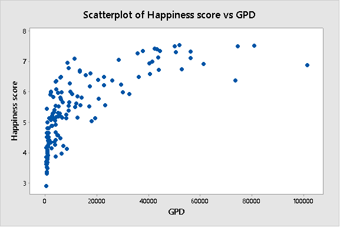
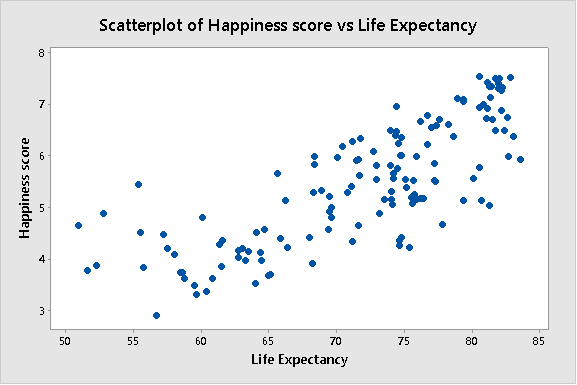
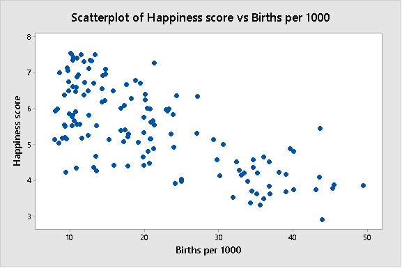
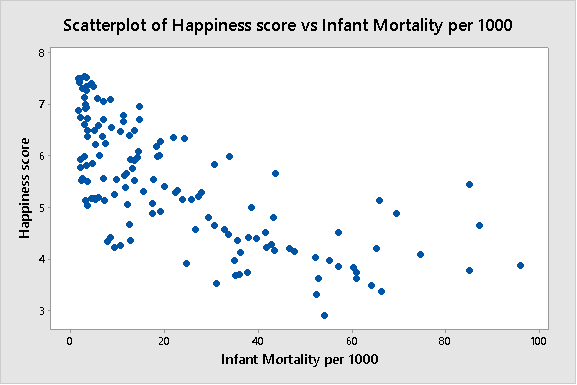
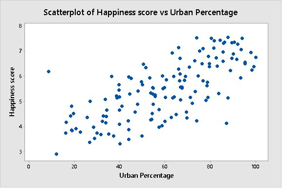
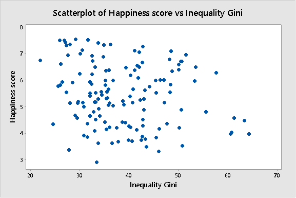
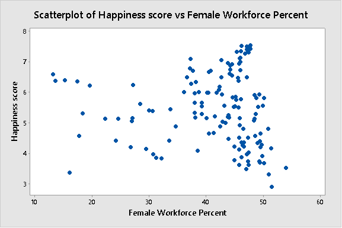
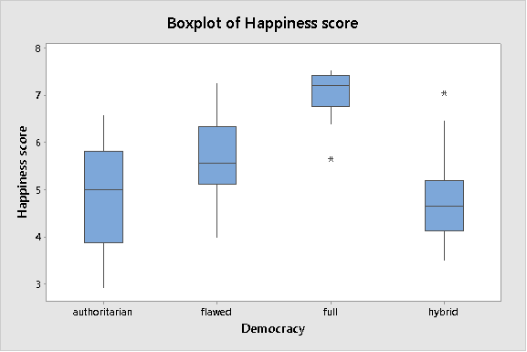
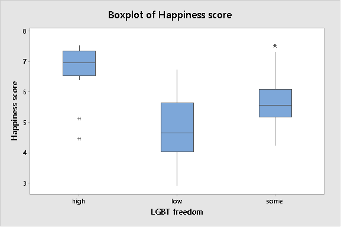
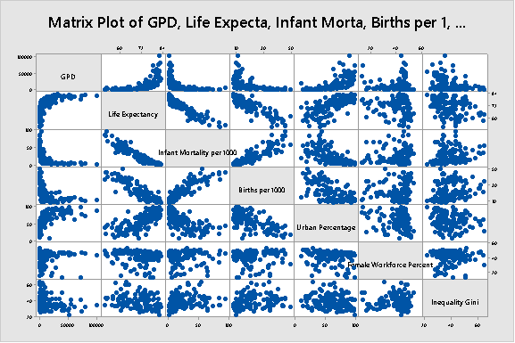

Date: 2017-09-06 18:53 
Author: Andrew Trick 
Title: Predicting a Country's Happiness
Name: Country Happiness Regression Analysis
Category: Statistical Modeling
Tags: regression, modeling, reporting
Summary: A look at the world happiness index and an evaluation of the factors that contribute to the general happiness of a countries population.  Variables were primarily focused on economic, political, and elegantarian factors. Originally conducted as a project for my SNHU Applied Stats II class. As it ended at around 30 pages, included is only a subset of the full project.  

#####The full version of this regression analysis is available for download <a href="../data/at_happiness_full.pdf" download>here</a>  

###Introduction
The World Happiness Report, published by the United Nation’s Sustainable Development Solutions Network, is an annual survey whose findings reflect the state of happiness of people, split by country, throughout the world. Happiness is rated on a 0-10 scale in which countries can be evaluated and compared to one another. These ratings are created by considering the economic, social, health, and democratic factors within a country and normalizing, typically into a percentage of population or, sometimes, a more subjective 0-1 rating. While this happiness score found by the United Nations to quantify well-being is obviously strongly correlated to the independent variables they used to quantify it, only the final happiness scores were used in the dataset for this project.  The primary goal of this analysis is to determine if there is any kind of relationship between a country’s happiness index with other specific key factors chosen, and if this relationship can allow for future prediction of a country’s happiness level.

###Quantitative Predictors
Quantitative values include ‘GDP’, ‘Life Expectancy”, ‘Births per 1000’, ‘Infant Mortality per 1000’, ‘Urban Percentage’, ‘Female Workforce Percent’, and ‘Inequality gini’. GDP is the gross domestic product per capita.  Life expectancy is the average healthy expected life span of a person from the country in years. Births per 1000 is the birthrate of the country per 1000 people, while infant mortality per 1000 is the death rate of children under the age of one per 1000 births. Urban percentage is the percent of the country’s population that lives within an urbanized area and female workplace percent is the percentage of the workforce in a country that is female. Finally, inequality gini displays the wealth distribution of a country, where 0 equates to perfect equality and 1 would represent a vast disproportion where the overwhelming majority of wealth is in the hands of a select few. 

###Qualitative Predictors
Variables ‘democracy’ and ‘LGBT freedom’ represent the two qualitative fields in the project.  Democracy is split categorically into varying levels of democratic freedom of a country.  Levels in this field, in descending order of freedom, are: full, flawed, hybrid, and authoritarian.  LGBT freedom represents the amount of laws passed in a country which protect the civil rights of lesbian, gay, bisexual, and transgender people. The levels for this variable are: high, some, and low. These levels were primarily determined based on marriage, adoption, military service, anti-discrimination, and gender identity laws a country has passed.
 

###EDA
Visually exploring the data can provide several insights into how to proceed with regression analysis for this particular dataset.  Below is a subset of the data- the top five ‘happiest’ countries- to give an idea of what the sample looks like.  Scandinavia dominates.
 
 Country	GPD	Happiness score	Life Expectancy	Births per 1000	Infant Mortality per 1000	Urban Percent	Female Workforce Percent	Democracy Score	LGBT freedom	Inequality Gini
Denmark	51989.293	7.526	80.548	10.1	2.9	87.676	47.687	full	high	29.1
Switzerland	80945.079	7.508	82.848	10.2	3.4	73.912	46.151	full	some	31.6
Iceland	50173.339	7.500	82.060	13.4	1.6	94.137	47.627	full	high	26.9
Norway	74400.369	7.498	81.751	11.5	2	80.473	47.110	full	high	25.9
Finland	42311.036	7.413	81.129	10.5	1.9	84.221	47.740	full	high	27.1

&nbsp;&nbsp;&nbsp;&nbsp;&nbsp;&nbsp;  
&nbsp;&nbsp;&nbsp;&nbsp;&nbsp;&nbsp;  
&nbsp;&nbsp;&nbsp;&nbsp;&nbsp;&nbsp;  
&nbsp;&nbsp;&nbsp;&nbsp;&nbsp;&nbsp;  
&nbsp;&nbsp;&nbsp;&nbsp;&nbsp;&nbsp;  
&nbsp;&nbsp;&nbsp;&nbsp;&nbsp;&nbsp;  
&nbsp;&nbsp;&nbsp;&nbsp;&nbsp;&nbsp;  
&nbsp;&nbsp;&nbsp;&nbsp;&nbsp;&nbsp;  
&nbsp;&nbsp;&nbsp;&nbsp;&nbsp;&nbsp;  

Visually inspecting these plots shows that most of the single-order variables have at least some level of effect on happiness of a country.  Inequality gini and female workforce percentage appear to have little to no correlation, while the other six quantitative predictors depict a strong relationship, be it linear or curvilinear. The qualitative variable boxplots also seem to display an expected, significant relationship amongst each fields respective categories.

###Least-Squares Regression 
HAPPINESS SCORE = 0.27 + 0.000011 GDP + 0.0605 LIFE EXPECTANCY - 0.0080 BIRTHS PER 1000  + 0.00418 INFANT MORTALITY PER 1000
+ 0.00839 URBAN PERCENTAGE - 0.00979 FEMALE WORKPLACE PERCENT + 0.01202 INEQUALITY GINI + 0.065 DEMOCRACY (FLAWED) 
+ 0.438 DEMOCRACY (FULL)- 0.100 DEMOCRACY (HYBRID) 
+ 0.406 LGBT FREEDOM (HIGH) + 0.142 LGBT FREEDOM (LOW)

Looking deeper into the variables, T-tests provide methods of determining the direct significance of each independent variable to the dependent.  GDP, LIFE EXPECTANCY, and URBAN PERCENT are by far the strongest predictors of happiness in this model.  The weakest appearing to be BIRTHS PER 1000 and INFANT MORTALITY PER 1000. The qualitative predictors encompassing the democracy type also have high p-values, yet should not necessarily be thrown out as they could provide added strength to the model, particularly when introducing interaction terms. 

###Interaction EDA
&nbsp;&nbsp;&nbsp;&nbsp;&nbsp;&nbsp;  
&nbsp;&nbsp;&nbsp;&nbsp;&nbsp;&nbsp; 

The matrix plot above gives a quick view of which predictors may have an effect on each other, (not necessarily in regards to happiness though). It is important to keep in mind that, while these scatterplots give an idea of relationships between independent variables, they may in fact be additive and not necessarily interactive. Female workforce percent and inequality gini both appear to have very little connection with other variables.  The remaining five look to each have some type of linear or curvilinear relationship with other independent variables. While this implies some form of covariance, care must be taken watch for multicollinearity.

###Stepwise Regression takes place here.. 
I opted to exclude this from the final write up for the site. A full version is available for download <a href="../data/at_happiness_full.pdf" download>here</a>

###Final Model
Analysis of Variance

Source                       DF   Adj SS   Adj MS  F-Value  P-Value
Regression                    8  143.374  17.9217    55.07    0.000
  GPD                         1   17.388  17.3877    53.43    0.000
  Births per 1000             1    2.172   2.1720     6.67    0.011
  Female Workforce Percent    1    4.057   4.0574    12.47    0.001
  GDP^2                       1    7.704   7.7038    23.67    0.000
  births^2                    1    4.244   4.2440    13.04    0.000
  female^2                    1    5.076   5.0756    15.60    0.000
  LGBT freedom                2    2.576   1.2880     3.96    0.021
Error                       129   41.980   0.3254
Total                       137  185.353

Model Summary

S    R-sq  R-sq(adj)  R-sq(pred)
0.570459  77.35%     75.95%    74.26% 

Coefficients

Term                           Coef   SE Coef  T-Value  P-Value 
Constant                      2.197     0.802     2.74    0.007
GPD                        0.000072  0.000010     7.31    0.000  
Births per 1000              0.0750    0.0290     2.58    0.011  
Female Workforce Percent     0.1365    0.0386     3.53    0.001  
GDP^2                     -0.000000  0.000000    -4.87    0.000  
births^2                  -0.001861  0.000515    -3.61    0.000  
female^2                  -0.002146  0.000543    -3.95    0.000  
LGBT freedom
  high                        0.540     0.197     2.74    0.007   
  some                        0.296     0.153     1.93    0.056   

Regression Equation

Happiness score = 2.197 + 0.000072 GPD + 0.0750 Births per 1000
+ 0.1365 Female Workforce Percent - 0.000000 GDP^2 - 0.001861 births^2 
- 0.002146 female^2 + 0.540 LGBT freedom_high + 0.296 LGBT freedom_some

###Conclusion
In this model, the significant indicators of a country’s happiness score are based on three quantitative predictors, GDP per capita, births per 1000, and female workplace percentage, and one qualitative terms, LGBT freedoms- which is split into three categories (low, some, high). It also takes all three of the quantitative predictors second-order terms into account when determining a final happiness score.  With a model F-score of 55.07, P-value of < 0.000, and R2(adj) of 75.95, we can, with 99% confidence, explain around 76% the variance of the happiness score of a country based solely on these input. Furthermore, we can predict the future results of happiness of a country based on these same variables with an accuracy of around 74%, based on our final r-sq(pred) score. Finally, a standard error of .57 indicates that 95% of the actual results will fall within 1.14 points of the model’s predicted score.
In regards to this regression, GDP and LGTB freedom are both strong, positive indicators of the happiness of a country, while births and female workplace tend to a slight, negative correlation with the final score once reaching their specific, curvilinear maxes. Although the female workplace^2’s coefficient may bring the validity of full civil liberties into question, this regression does appear to imply that the stronger the economy and more robust the civil liberties of a country, the happier it’s population.... as long as there are not too many babies being born.

References  
The Economist Intelligence Unit. (2015). Democracy Index 2015. Retrieved from http://www.yabiladi.com/img/content/EIU-Democracy-Index-2015.pdf.
 The World Bank. (2016). World Bank Open Data. Retrieved from http://data.worldbank.org/.
 United Nations. (2016). Edited by John Helliwelll, Richard Layard, and Jeffrey Sachs. World Happiness Report 2016. Retrieved from http://worldhappiness.report/ed/2016/.
 Zhong, Raymond. (2015). ‘In Bhutan, Gross National Happiness Trumps Gross National Product.’ The Wall Street Journal. Retrieved from http://www.wsj.com/articles/in-bhutan-gross-national-happiness-trumps-gross-national-product-1450318359
