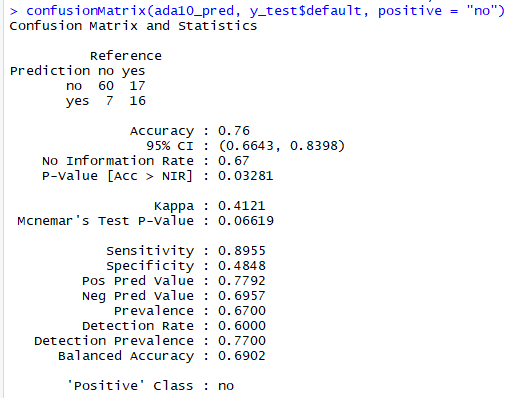
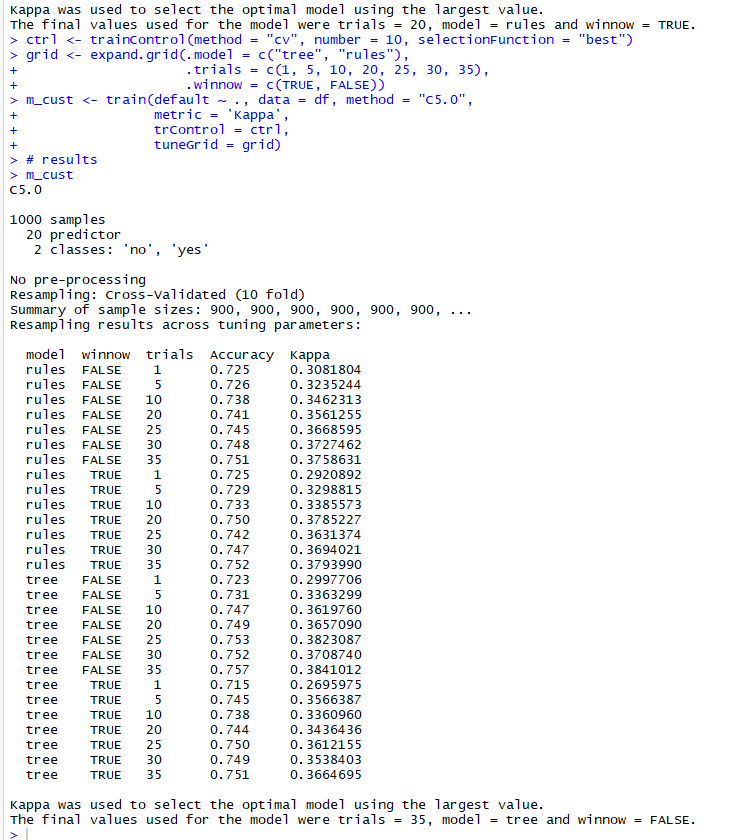
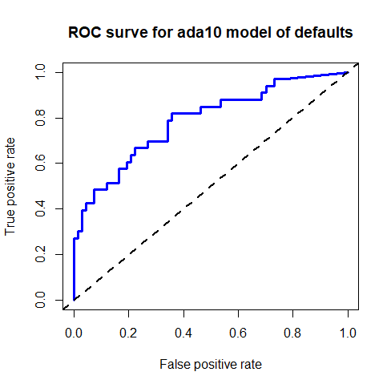

Title: Model Selection of Tree Classifiers in R
Slug: tree_selection
Date: 2019-01-28 15:30
Category: Machine Learning
Tags: modeling, classification, r, caret, trees
author: Andrew Trick
Summary: A recent lab for my machine learning class involved fitting and tuning decision tree models in R to find the 'best' option for predicting if a person will default given historic loan data. I work through the process of: processing the data for modeling, fitting it to a C5.0 decision tree model, comparing it to an 10-trial adaptive boosted version, and finally tuning the ensemble model to find the parameters which result in the highest accuracy.

# Model Selection of Tree Classifiers in R 

<br>
A recent lab for my machine learning class involved fitting and tuning decision tree models in R to find the 'best' option for predicting if a loan will default given fictional historic loan data. I work through the process of: processing the data for modeling, fitting it to a C5.0 decision tree model, comparing it to an 10-trial adaptive boosted version, and finally tuning the ensemble model to find the parameters which result in the highest accuracy.<br><br>

As most of my past work with machine learning has been done with scikit-learn in Python, I am finding this course to be extremely useful. Not only has it given me a deeper understanding of the strengths and weaknesses inherent in each type of algorithm, but it also included plenty of practice working in R. The textbook for this course is *"Machine Learning with R"* by Brett Lantz, and much of this process is taken from the book.
Data for this project is located at the [UCI Machine Learning Repository](https://archive.ics.uci.edu/ml/index.php).
<br>
## Data Preprocessing
As this post is focused on model creation and results analysis, I've elected to not report the importing, exploring, and processing steps for this project. Complete code for this project can be found at my [GitHub](https://github.com/leaflettuce/IT460-Coursework/blob/master/week_four/lab_4-2.R).
<br>
<br>
## Data Modeling
#### C5.0 Decision Tree
I first attempted to fit a standard C5.0 tree through the C50 library. This involves no parameter tuning to provide a base line of how accurate a tree is predicting given the inputs.
All models will be evaluated by their overall accuracy, kappa score, and ROC/AUC. The gmodels library gives an ease way to report all of these with the confusion matrix.

```
######
# C5 #   
######

#train
c5_model <- C5.0(X_train, y_train$default)
c5_model
# Model Results
summary(c5_model)

# Predict
c5_pred <- predict(c5_model, X_test)

# probability
c5_prob <-data.frame(predict(c5_model, X_test, type = 'prob'))
  

# matrix
confusionMatrix(c5_pred, y_test$default, positive = "no")
``` 
The following results in around 74% overall accuracy, 35% kappa and around 67% AUC. Not great but not terrible either. 
<br><br>
#### 10-Trial Adaptive Boosting
With these results, the next reasonable step is to attempt a boosted version of the C5.0 algorithm. The C5.0 library has this option built in and the number of trials can be specified. This is an ensemble method which trains on subsets of the data and iteratively trains the model based on results of previous fits, weighting error prone observations higher. Once a set number of trials are complete all of the 'weak' trees vote on the outcome of each test observation.
```
###############
# AdaBoost 10 #   
###############

# Train
ada10_model <- C5.0(X_train, y_train$default, trials = 10)
ada10_model
# Summary
summary(ada10_model)

# Predict
ada10_pred <- predict(ada10_model, X_test)

# probability
ada10_prob <-data.frame(predict(ada10_model, X_test, type = 'prob'))

# matrix
confusionMatrix(ada10_pred, y_test$default, positive = "no")
```
The results are looking a little better from the original single tree:
&nbsp;&nbsp;&nbsp;&nbsp;&nbsp;&nbsp;
<br><br>
#### Parameter Tuning with Caret
Finally, one last method will be explored to see if we can boost the accuracy any higher by tweaking the parameters. The caret library provides ways to attempt this in R. 
I opted to use Cross Validation to evaluate the model in the parameter gird search:
```
# Custom                   
ctrl <- trainControl(method = "cv", number = 10, selectionFunction = "best")
grid <- expand.grid(.model = c("tree", "rules"),
                    .trials = c(1, 5, 10, 20, 25, 30, 35),
                    .winnow = c(TRUE, FALSE))
m_cust <- train(default ~ ., data = df, method = "C5.0", 
                metric = 'Kappa',
                trControl = ctrl,
                tuneGrid = grid)
# results
m_cust
``` 

&nbsp;&nbsp;&nbsp;&nbsp;&nbsp;&nbsp;
<br>
Interestingly, grid search with cross validation returns a similar accuracy yet slightly lower kappa score than the original 10-trial adaboost.
It seems like we're hitting the upper bound of accuracy given this input data and a tree model.. An ROC visual can show us how this model trades off True positives with False positives:
```
#ROC
ada10_roc_pred <- prediction(predictions = ada10_prob$yes, labels = y_test)
ada10_perf <- performance(ada10_roc_pred, measure = 'tpr', x.measure = 'fpr')

# plot
plot(ada10_perf, main = "ROC surve for ada10 model of defaults",
     col = "blue", lwd = 3)
abline(a = 0, b = 1, lwd = 2, lty = 2)
```
&nbsp;&nbsp;&nbsp;&nbsp;&nbsp;&nbsp;
<br>
Given the data and the difficulty involved in predicting loan default likelihood, I think this is a pretty solid model. Other tree or ensemble methods (such as bagging methods or JRip) may be able to squeeze out a slightly higher accuracy, but I expect not by a very significant amount.
