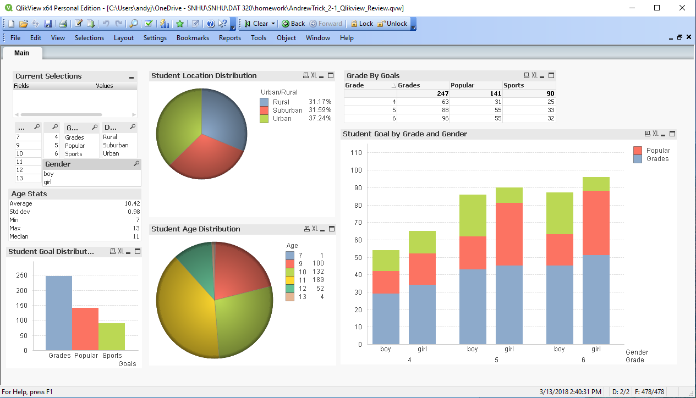
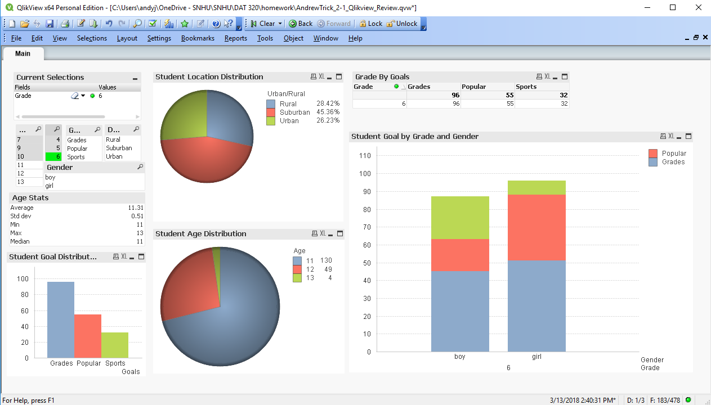

Title: Quick Qlikview Project
Slug: Student_dashboard
Date: 2018-03-13 15:00
Category: Data Visualization
Tags: EDA, Qlikview, Dashboard, reporting, survey
author: Andrew Trick
Summary: Quick dashboard I threw together in Qlikview for a school assignment. Data was a survey collection of goal opinions of 4th to 6th graders in Michigan schools. A few demographic variables are also recorded. 

# Student Goal Dashboard

Homework Assignment was to throw together a dashboard in Qlikview which would allow for exploration of the survey results of Michigan students being asked about what they consider their most important goals in school. Data originally from Caregie Mellow University, data located at: http://lib.stat.cmu.edu/DASL/Datafiles/PopularKids.html. I first created the selection list box and variable specific selection boxes which will provide the ability to jump around sample demographics. This will allow for the tables and charts to change based upon selected variables.\
  
I opted for two specific bar charts for examination: An overall histogram of 'most important goals' for students, and a barchart of goal choice v. Gender and Grade. This provides users to see both the general goals of importance per selection, while also the grade/gender split considerations as well.
  
Additionally, Two pie charts are included to display the demographic proportions of each selection. Age and Location both were expected to provide the most interesting insights into the analysis.
  

  
Final results indicate that a large majority of student consider grades their most important goal in school. Followed secondly by popularity. While the proportion split amongst these considers stay relatively constant, we can see a trend of girls increasingly their valuation of popularity as they move from 4th on to 5th and 6th grades. 

 
## 6th Grader Segmentation
I also included a screenshot of a 6th graders selection so as to provide an example of the ease of use and power Qlikview dashboards can introduce to exploratory data analysis.
  

  
Quick analysis: While for the entire sample location demographics are most-or-less evenly split and age’s range about evenly between 9, 10, and 11, Qlikview allows for quick variable selection to explore the sample data.  The above screenshot shows a selection of the 6th graders in the dataset. From this we can see that most of the 6th graders surveyed were 11 years old- the remainder are 12 and 13- and about 45% of them are from the suburbs.