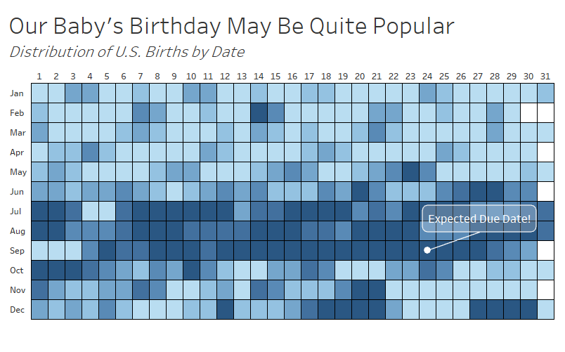
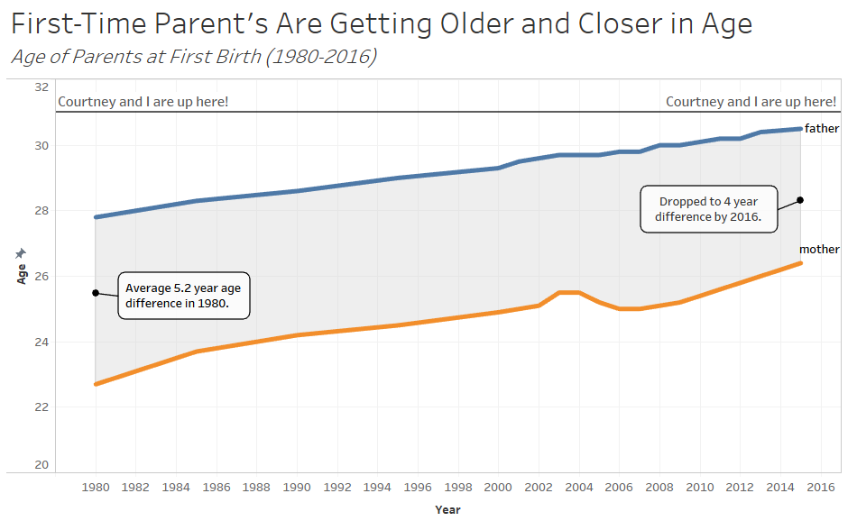
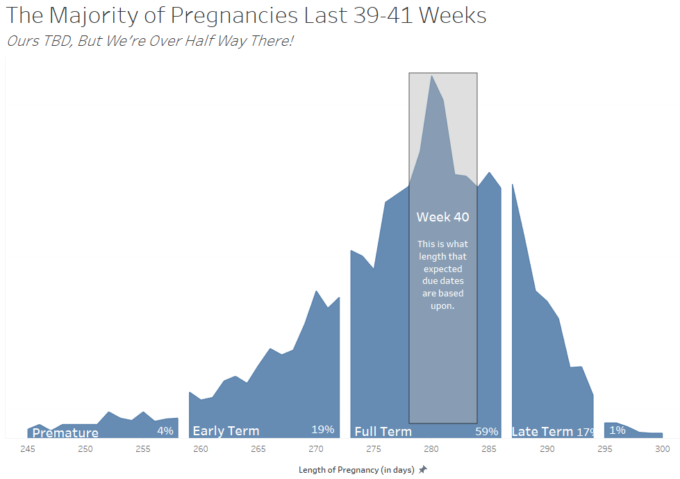

Title: A Baby Own the Way
Slug: baby_stats
Date: 2018-06-02 15:00
Category: Data Visualization
Tags: visualizing, Tableau, mog
author: Andrew Trick
Summary: My wife and I have a child on the way! With this on my mind lately, I thought it would be interesting to grab some data and visualize tendencies seen throughout pregnancy and birth. I dug into CDC: National Center for Health Statistics and Social Security datasets and found a few interesting trends to visualize.  

My wife and I have a child on the way! With this on my mind lately, I thought it would be interesting to grab some data and visualize tendencies seen throughout pregnancy and birth. I dug into CDC: National Center for Health Statistics and Social Security datasets and found a few interesting trends to visualize.  
 
I'm also currently in the middle of my data vis class and considered this a great opportunity to focus on not just representing data, but also in crafting a narrative with it. So, once the data was sourced (some of which was in PDF form -_-), I pulled it into Python and gave EDA a go with Seaborn. I already had a generalized idea of what would probably be displayed in the data and what I wanted to achieve with the visuals, but I continued with this step to ensure my preconceived notions were correct and that nothing else interesting was hiding in there. 
 
Once I finished some quick EDA, I pulled the data into Tableau for visual creation. Here are the results:

 
&nbsp;&nbsp;&nbsp;&nbsp;&nbsp;&nbsp;
 
Our due date of September 24th is not that uncommon. I'm happy with how this visual came out and I believe it imparts a generalized take away of which months and days are more popular for births- my goal with the heatmap.  I worry the lack of a key for the color gradient may lead to some implications that the difference between days is larger it actually is. With the purpose here of simply informing the audience of the trends, I consider it acceptable that it may not be 100% explainable and accurate (more form over function here).  
  

 
&nbsp;&nbsp;&nbsp;&nbsp;&nbsp;&nbsp;
 
A pretty direct line chart indicating the average age of parents at their first child's birth. This is about what I had expected, aside from the fact that there is still a 4 year age difference between fathers and mothers average age. The shading was possible thanks to a blog post by Rody Zakovich at datatableauandme.com, as I was unexperienced in creating path-lines for something like this in Tableau before. Also created a reference line to indicate where my wife and I sit on  this chart.
  

&nbsp;&nbsp;&nbsp;&nbsp;&nbsp;&nbsp;
 
Last up is the distribution of the gestational length of mothers. 40 weeks is the expected range for new parents. Interesting to see that 'full term' pregnancies only account for about 60% of births. 
  

##Kupo, Kupo!
 
&nbsp;&nbsp;&nbsp;&nbsp;&nbsp;&nbsp;
 
And how about a bonus frequency histogram of the color of baby clothing we've purchased so far! <(^.^)>
 