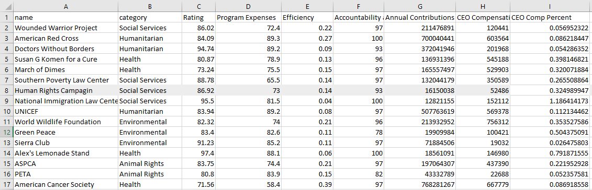
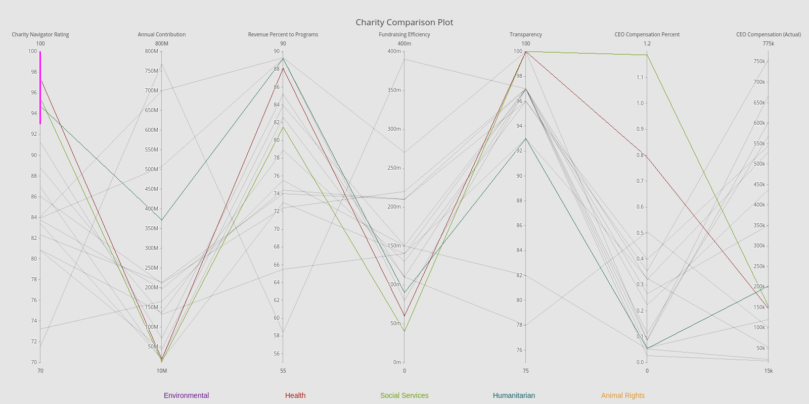

Title: Parallel Coordinates Plot using Plotly  
Slug: charity_coords
Date: 2019-01-11 12:30
Category: Data Visualization
Tags: visualizing, plotly, EDA, charities, python
author: Andrew Trick
Summary: Over the holiday season I heard several discussions on which charities are best to donate to and why some are better than others. With this in mind, I thought it would be interesting to examine the stats which set one charity over another and find a way to visualize these in an effective manner. With some help from Charity Navigator, I was able to source and collect the appropriate information and thought it a great time to finally give Plotly a go. 

# Charity Comparison Plot
<br>
Over the holiday season I heard several discussions on which charities are best to donate to and why some are better than others. With this in mind, I thought it would be interesting to examine the stats which set one charity over another and find a way to visualize these in an effective manner. With some help from Charity Navigator, I was able to source and collect the appropriate information and thought it a great time to finally give Plotly a go. 
<br><br>
## Data Collection
[Charity Navigator](https://www.charitynavigator.org) seems (from some quick research) to be one of the leading and trusted sources to grab charity ratings from. They analyze both the financial data and stats on the transparency and accountability of the organization. From this site, I manually listed some of the more important stats from each report, including charity navigator's overall rating. Some of the other features I grabbed were fund-raising efficiency, CEO compensation, annual contributions, and percentages of revenue towards programs. I opted to grab only 15 or so of the more known charities.. given more time I'm hoping to connect to their API and find a way to load in a much larger amount. 
<br>
The rather simple csv sheet I'm working with:
<br><br>
&nbsp;&nbsp;&nbsp;&nbsp;&nbsp;&nbsp;
<br><br>
## Planning The visual
So I've wanted to create a parallel coordinate plot for awhile now; I think they can provide a very informative and intuitive method of comparison. With the charity organizations have numerous dimensions to compare, this seemed to fit perfectly. 

Exploring routes to creating parallel coord charts in Python, I came across [Plotly](https://plot.ly) and thought its built-in interactive features for this type of plot were awesome. So, I went about running Python and plotly to create the visual.
<br><br>
## The Code
I started with the required imports and by importing the data in with pandas:
```python
import pandas as pd
import plotly 
import plotly.plotly as py
import plotly.graph_objs as go
import os

#Plotly credentials
plotly.tools.set_credentials_file(username='Andyjtrick', api_key= os.environ.get("PLOTLY_KEY"))


df = pd.read_csv('./data/test.csv')

```
<br>
Next was to detail the plot. The first section instructs Plotly to color the lines based upon their organization category. Following that is the code to set the numerous y axes, their ranges, and labels. 
```python
data = [
    go.Parcoords(
        line = dict(color = df['cat_num'],
                   colorscale = [[0, '#6C9E12'], ## social services
                                [0.25,'#0D5F67'], ## humanitarian
                                [0.5,'#AA1B13'], ## health
                                [0.75, '#69178C'], ## environmentla
                                [1, '#DE9733']]),  ## animal rights
        dimensions = list([
            dict(range = [70,100],
                 constraintrange = [93,100],
                label = 'Charity Navigator Rating', values = df['Rating']),
            dict(range = [10000000, 800000000],
                label = 'Annual Contribution', values = df['Annual Contributions']),
            dict(range = [55,90],
                label = 'Revenue Percent to Programs', values = df['Program Expenses']),
            dict(range = [0,0.4],
                label = 'Fundraising Efficiency', values = df['Efficiency']),
            dict(range = [75, 100],
                label = 'Transparency', values = df['Accountability and Transparency']),
            dict(range = [0, 1.2],
                label = 'CEO Compensation Percent', values = df['CEO Comp Percent']),
            dict(range = [15000, 775000],
                label = 'CEO Compensation (Actual)', values = df['CEO Compensation'])
        ]),
            showlegend = True
    )
]
```
<br>
Finally, I end up with some minor cosmetic edits and code to annotate the labels at the bottom of the page. The last two lines send the data and visual over to plotly for online hosting. 
```python
layout = go.Layout(
    autosize=False,
    width=1600,
    height=800,
    plot_bgcolor = '#E5E5E5',
    paper_bgcolor = '#E5E5E5',
    
    title='Charity Comparison Plot'
)

# Categorical Labels
labels = [
        dict(xref='paper', yref='paper', x=0.35, y=-0.085,
                              xanchor='center', yanchor='top',
                              text="Health",
                              font=dict(family='Arial',
                                        size=14,
                                        color='#AA1B13'),
                              showarrow=False),
        dict(xref='paper', yref='paper', x=0.5, y=-0.085,
                              xanchor='center', yanchor='top',
                              text="Social Services",
                              font=dict(family='Arial',
                                        size=14,
                                        color='#6C9E12'),
                              showarrow=False),
        dict(xref='paper', yref='paper', x=0.65, y=-0.085,
                              xanchor='center', yanchor='top',
                              text="Humanitarian",
                              font=dict(family='Arial',
                                        size=14,
                                        color='#0D5F67'),
                              showarrow=False),
        dict(xref='paper', yref='paper', x=0.20, y=-0.085,
                              xanchor='center', yanchor='top',
                              text="Environmental",
                              font=dict(family='Arial',
                                        size=14,
                                        color='#69178C'),
                              showarrow=False),
        dict(xref='paper', yref='paper', x=0.80, y=-0.085,
                              xanchor='center', yanchor='top',
                              text="Animal Rights",
                              font=dict(family='Arial',
                                        size=14,
                                        color='#DE9733'),
                              showarrow=False)
                              
        ]
layout['annotations'] = labels

# print the plot
fig = go.Figure(data = data, layout = layout)
py.iplot(fig, filename = 'Charity_Rough')
```
 <br><br>
## The Final Visual
Click the image to go to the interactive version! (And try selecting different segments of the y axes) 
[](https://plot.ly/~Andyjtrick/4/charity-comparison-plot/#/plot)