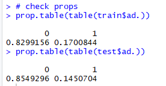

Title: Identifying Advertisements with ANN's
Slug: identifying_ads
Date: 2019-02-18 15:30
Category: Machine Learning
Tags: modeling, classification, r, caret, ann, nb, knn
author: Andrew Trick
Summary: I pull data from the UCI Machine Learning Repo and use it to train a model which can identify advertisements based upon their image size and URL terminology. I work through cleaning the data, attempting a few different fitting algorithms, and end with some parameter-tuning of an ANN. My final model results in over 97% accuracy in classifying advertisements in testing. Originally conducted for a Machine Learning course as SHHU focused on the R language. 

# Identifying Advertisements with ANN's
I pull data from the UCI Machine Learning Repo and use it to form a model which can identify advertisements based upon their image size and URL terminology. I work through cleaning the data, attempting a few different fitting algorithms, and end with some parameter-tuning of an ANN. My final model results in over 97% accuracy in classifying advertisements in testing. Originally conducted for a Machine Learning course as SHHU focused on the R language. 
<br>
## Data Description
Data for this project is located at the [UCI Machine Learning Repository](https://archive.ics.uci.edu/ml/datasets/Internet+Advertisements). The dataset contains 3297 observations and 1558 attributes. Three of the columns represent imaage size; hieght, weight, and aspect ratio. The dependent in this dataset is a categorical column specifying ad or non-ad. The remaining 1554 form a sparse, document-term matrix of binary values indicating URL terminology used for each image URL. 
<br>
## Exploration
```
#############################
# Library Imports and Setup #
#############################
# Working Dir
setwd('e:/projects/it460/final')

# Data Import
df <- read.csv("../data/final/ad.csv")


###############
# Exploration #
###############
str(df)

summary(df[1])
summary(df[2])
summary(df[3])

# histograms of size vars
hist(df$X125)
hist(df$X125.1)
hist(df$X1.0)

# scatter of size to width
plot(df[0:2])
```
An example of some of the output: 
<br>
&nbsp;&nbsp;&nbsp;&nbsp;&nbsp;&nbsp;<br>
&nbsp;&nbsp;&nbsp;&nbsp;&nbsp;&nbsp;<br>
&nbsp;&nbsp;&nbsp;&nbsp;&nbsp;&nbsp;
<br>
I thought to then attempt a heatmap of the sparse matrix:
```
library(ggplot2)
library(reshape2)
test_m <- melt(df[4:1558])
ggplot(test_m, aes(X1, variable, fill = value)) + geom_raster() +
  scale_fill_gradient(low = "white", high = "red")
```
&nbsp;&nbsp;&nbsp;&nbsp;&nbsp;&nbsp;
<br>
This doesn't tell us much outside the fact that the URL terms come in groupings in the data.. Not too useful aside from highlighting the importance to randomize the rows when splitting the train and test apart.
<br>
And finally, a quick histogram of ad vs non-ad in the dataset:
```
ggplot(aes(x = ad.), data = df) + 
  geom_histogram(stat = "count")
```
&nbsp;&nbsp;&nbsp;&nbsp;&nbsp;&nbsp;
<br>
About 15% of the observations are ads.
<br>
<br>
## Data Preprocessing
#### Cleaning & Missing Values 
Coming from the UCI repo, the data is relatively clean and ready to go. Just a few minor edits here. I start by setting the binary values into factors and the size variables into numeric type.
I opted to remove the missing values rather than impute a mean or mode values. I chose this primarily due to the disparity of each size variable. They each have a large range and little pattern. Any replacement with mean or mode, I worried, would have biased the data and caused more damage than any benefit gained from having a larger training set.
```
############
# Cleaning #
############
# Set all vars as factors
df[] <- lapply(df, function(x) as.factor(x))


# Missing Values 
df[ df == "   ?" ] <- NA
df[ df == "     ?" ] <- NA
df[ df == "?" ] <- NA


# set numeric
df$X125 <- as.numeric(as.character(df$X125))
df$X125.1 <- as.numeric(as.character(df$X125.1))
df$X1.0 <- as.numeric(as.character(df$X1.0))


# replace NA's in terminology
df$X1[is.na(df$X1)] <- 0
df$X1 <- droplevels(df$X1)
  
# remove missing size data
df <- na.omit(df)

############################
# Clean classification var #
############################
summary(df$ad.)
df$ad. <- ifelse(df$ad. == "ad.", 1, 0)
df$ad. <- as.factor(df$ad.)
```

I also normalized the size data here. I chose normalization over standardization because it fits more nicely with the 0-1 scale of the binary variables. Any distance based ML algorithms will benefit from all inputs being on a similar scale like this.
```
#################
# Normalization #
#################
# min max normalization
min_max_normalize <- function(x) {
  return((x - min(x)) / (max(x) - min(x)))
}

# apply to numeric columns
df[1:3] <- as.data.frame(lapply(df[1:3], min_max_normalize))

# check it
head(df[1:3])
summary(df[1:8])
```
&nbsp;&nbsp;&nbsp;&nbsp;&nbsp;&nbsp;
<br> Normalization looks like it worked just fine.
<br>
## Comparison Models
Although my original assumption was that a neural network would perform best with this data, I started off with two baseline models that I thought would be fun to explore and interesting to compare:
#### Naive Bayes
So NB can perform pretty solid with sparse matrix data like most of this input. While I think its safe to say the assumption of input variable independence is broken, I've had a track record of it still working pretty well.

Some additional preprocessing is needed for NB: The following code allowed me to examine the distribution of the size var values, then I binned out each of these numeric vars by quantiles.
```

#set factor
df$ad. <- factor(df$ad.)
df[4:1558] <- lapply(df[4:1558], function(x) as.factor(x))

str(df[1:5])
str(df[1555:1559])

hist(df$X125, breaks = c(0, .025, .05, .1, .2, 1))
hist(df$X125.1, breaks = c(0,.05, .1, .2, .3, .4, 1))
hist(df$X1.0, breaks = c(0, .01, .015, .02, .03, .035, 1))

summary(df$X125)


############
# Bin Data #
############

df$X125 <- with(df, cut(X125, 
                        breaks=quantile(X125, probs=seq(0,1, by=0.25), na.rm=TRUE), 
                        include.lowest=TRUE))

df$X125.1 <- with(df, cut(X125.1, 
                          breaks=quantile(X125.1, probs=seq(0,1, by=0.25), na.rm=TRUE), 
                          include.lowest=TRUE))

df$X1.0 <- with(df, cut(X1.0, 
                        breaks=quantile(X1.0, probs=seq(0,1, by=0.25), na.rm=TRUE), 
                        include.lowest=TRUE))


str(df[1:5])
```
&nbsp;&nbsp;&nbsp;&nbsp;&nbsp;&nbsp;
<br>
Above screenshot gives a view of the new data structure for the binned vairables. All looks good and the data is ready, I then tossed it into a pretty generic NB model with the e1071 library:

```
###############
# train model #
###############

nb_model <- naiveBayes(X_train, y_train, laplace = 0)
test_pred <- predict(nb_model, X_test, type = "class")

# Evaluate
confusionMatrix(as.factor(test_pred), as.factor(y_test), positive = "1")
```
&nbsp;&nbsp;&nbsp;&nbsp;&nbsp;&nbsp;
<br>
Results are pretty solid. Accuracy of .967 and a kappa of close to .86 indicate it's pretty effective at predicting the test data. Sensitivity could perform better but he false positive rate is extremely low which could be good in real life application of this model. It would be mistakenly blocking very few non-ads. 
<br>
I attempted another NB model and introduces a laplace parameter, but the results were on par with above so I'll skip it here.
<br><br>
#### K Nearest Neighbor
I next thought to give K-nn a go. I find this model fun to work with and thought it could be an effective classifier for data which includes a sparse matrix like this one. I also though it would be able to account for the *expected* complex relationships between input variables (The URL terms relating). 
I brought in the data from the original cleaning process for this one. K-nn requires evenly-scaled numeric input data for its distance function to work properly, and this has already been done. I do print out the split proportions to make sure I'm close to even in the train and test splits (something I forgot to do earlier):
<br>&nbsp;&nbsp;&nbsp;&nbsp;&nbsp;&nbsp;
<br>
Close enough for me. I use caret to perform 10-fold cross validation and tune the number of k.
```
# Custom          
ctrl <- trainControl(method = "repeatedcv", number = 10, repeats = 3)

m_cust <- train(ad. ~ ., data = train, method = "knn", 
                trControl=ctrl,
                preProcess = c("center", "scale"),
                tuneLength = 10)

# results
m_cust
```
&nbsp;&nbsp;&nbsp;&nbsp;&nbsp;&nbsp;
<br>
Looks like k = 5 is the best fit for this. Lets test it:

```
# predict
m_pred <- predict(m_cust, newdata = test)

# Evaluate
confusionMatrix(as.factor(m_pred), as.factor(y_test), positive = "1")
```
&nbsp;&nbsp;&nbsp;&nbsp;&nbsp;&nbsp;
<br>
A decent 96% accuracy and 78% kappa. Not too bad, but not performing as well as the NB model above. Again we have a great specificity, but maybe too many false negatives- which would equal ads bypassing a filter in our applications of this model.
<br>
<br>

## Artificial Neural Network
#### Default Model
Finally, to the ANN. As mentioned earlier, I think ANN will work best with this data due to its complex relationships and neural net's abilities to work well with absurd connections in input data. I also just wanted more practice with NN's in R, soooo here we go. I start by fitting the default parameters in the neuralnet package.
Also of note: I create a feature here as well that I'm calling 'keyword_count'. This is simply the total number of url keywords for each observation.
```
# add feature
train$keyword_count <- rowSums(train[4:1558] == 1)
test$keyword_count <- rowSums(test[4:1558] == 1)

# prep
predictors <- colnames(train[, c(1:1558, 1560)]) 
fit_details <- as.formula(paste('ad. ~ ' ,paste(predictors,collapse='+')))

#  BASIC
basic <- neuralnet(fit_details, data =train, hidden = 1)

# basic     // acc - 94, kappa - 78  
basic_results <- compute(basic, test[, c(1:1558, 1560)])
basic_pred <- basic_results$net.result
cor(basic_pred, test$ad.)

confusionMatrix(as.factor(round(basic_pred)), as.factor(test$ad.), positive = "1")
```
&nbsp;&nbsp;&nbsp;&nbsp;&nbsp;&nbsp;
<br>
So the default ANN model performs about on par with the NB. The main difference here is that it sees a slightly higher kappa and trades off some specificity for sensitivity. This is the first model to have fewer false negatives than false positives. The use and applications of the final model would determine which error rate is more important.. For now I'll stick with overall accuracy and kappa for evaluation. 

<br>
#### Parameter Tuning (Trends in Variations)
I next worked on tuning parameters within neuralnet to see what might have some effect and increase performance of the network. Caret grid tuning was out of the question for me with the amount of processing power that would require, so I started by manually tweaking the network size to see how that would effect results.
Increasing the network layer and neuron size showed an interesting insight: A significant trend towards overfitting. The default neuron network for this library is c(1) - indicating one hidden neuron in one layer. I worked my way up from to this c(5), c(3,1), and c(5,3,1). Each increase in the network size resulted in lower accuracy and predictive power. It appears the model begins to overfit very quickly with this training data. While increasing the volume of the data may have resolved this problem, that was not an option. 
So.. I opted to keep the one hidden neuron network and work on tweaking other parameters to see what might happen. This revolved primarily around switching out activation functions (neuralnet() by default uses a logistic activation with sum of squares error function to fit and backpropogate). I manually tuned these in different patterns, while also switching out the backprop method from weighted backtracking to non-weighted. 
Lastly, I cut the 'threshold' value in half from 0.01 to 0.005. This parameter indicates what minimum partial derivative limit of the error function the fitting process should stop at. This step was able to squeeze out a little more accuracy from the model, without any noticeable problem of overfitting. 

<br>
#### Final Model
So after param tuning, I ended with the following model. It uses a tangent hyperbolic function as the activation function, while still using SSE as the error funct. This change in act funct would result in a stronger gradient descent, allowing the algorithm to traverse more quickly to the optimum.  
```
# REFIT
refit_model <- neuralnet(fit_details, data = train, hidden = 1,
                             lifesign = "full", stepmax = 50000,
                             act.fct = "tanh", err.fct = 'sse', 
                             algorithm = "rprop-", threshold = 0.005)

# refit     // acc - 97, kappa - 89
refit_results <- compute(refit_model, test[, c(1:1558, 1560)])
refit_pred <- refit_results$net.result
cor(refit_pred, test$ad.)

confusionMatrix(as.factor(round(refit_pred)), as.factor(test$ad.), positive = "1")
```
&nbsp;&nbsp;&nbsp;&nbsp;&nbsp;&nbsp;
<br>
So parameter tuning did little to increase the overall accuracy of the model.. It dropped it actually, indicating the simple logistic model is probably the best option for the given data. The reason I kept working on this, even with the loss of overall accuracy is its slight increase in sensitivity.  Given the business goals of the project, an overall decrease in accuracy may be worth ensuring all actual trues are caught. 

```
# ROC
roc_pred <- prediction(predictions = refit_pred, labels = test$ad.)
refit_perf <- performance(roc_pred, measure = 'tpr', x.measure = 'fpr')

# plot
plot(refit_perf, main = "ROC surve for Refit ANN",
     col = "blue", lwd = 3)
abline(a = 0, b = 1, lwd = 2, lty = 2)
```
&nbsp;&nbsp;&nbsp;&nbsp;&nbsp;&nbsp;
<br>
The ROC shows the relationship between true positives and false positives for the model. This plot shows a pretty good trade off with an AUC of around 94%.

## Results and Further Considerations
In review, a K-NN algorithm works surprisingly well and should be used if false positives are severely damaging in application- This model had, by far, the lowest count of these in the test. If overall accuracy is the goal on the other hand, the basic ANN fit from neuralnet is able to predict over 97% of all test observations correctly and would be arguably the 'best' option. It all comes down to how the system would be implemented. 
<br><br>This model would also require constant upkeep to be useful for anything like a ad blocker though. The fact that it trains on URL keywords is its primary weakness; Ad companies would probably be able to quickly pick up on this bias and switch them up. To combat this, a system could be set up that grabs new training data every week to keep the keyword dictionary up to date and new keywords accounted for in the model. 
<br><br>Outside of these considerations, I'm happy with this project and excited to see that even a simple ANN can be extremely effective at capturing complex, sparse input data.  
