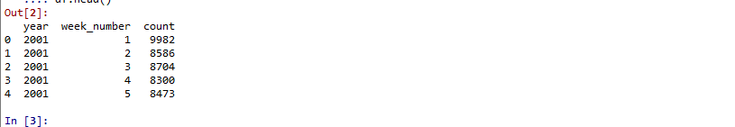
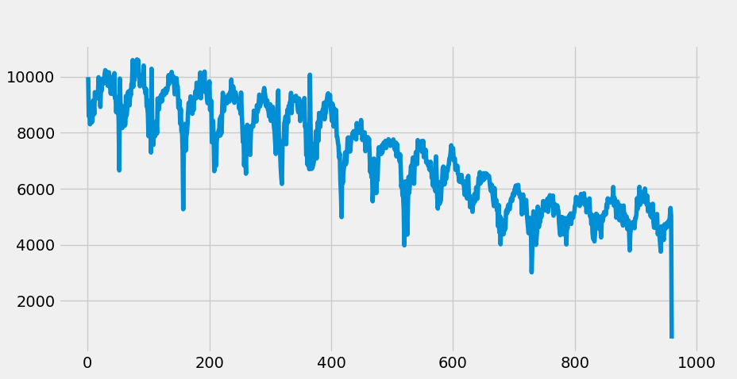
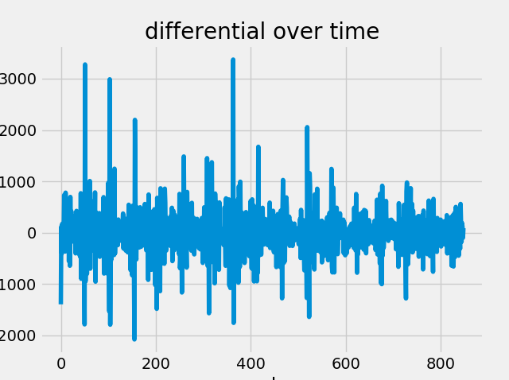
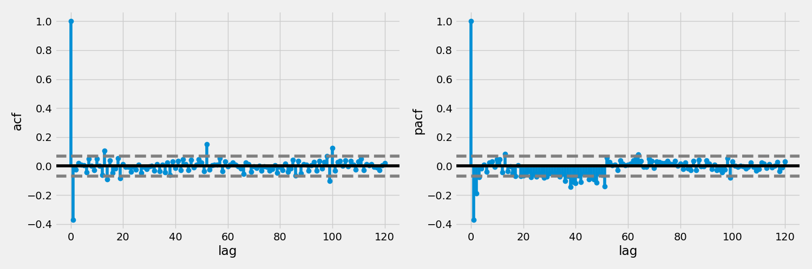
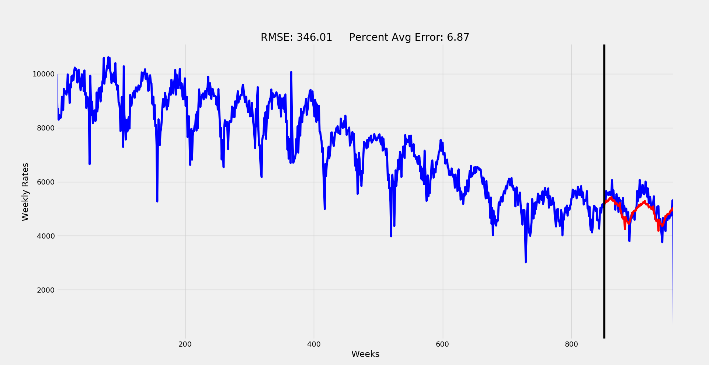
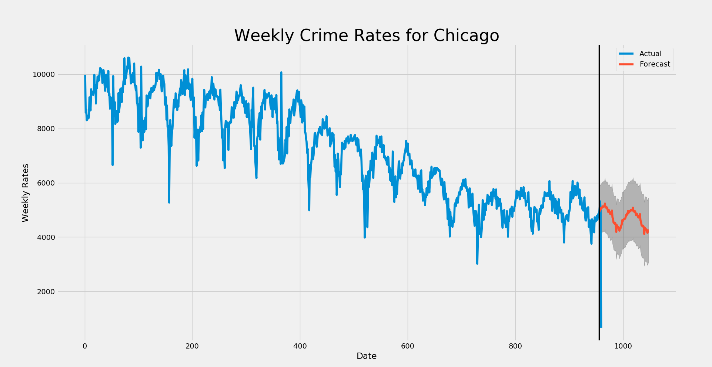
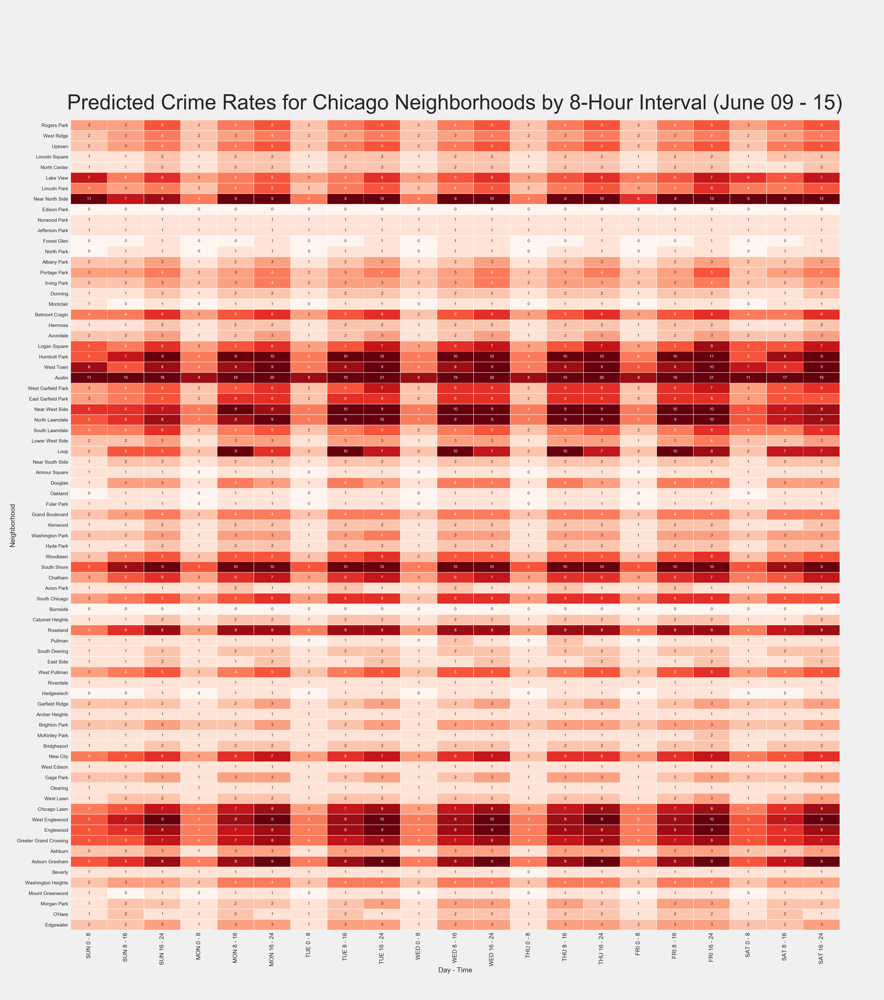

Title: Forecasting Chicago Crime Rates with SARIMA
Slug: crime_forecaster
Date: 2019-06-12 12:30
Category: Machine Learning
Tags: Python, SARIMA, time-series, forecasting, heatmap, pandas, Tableau, matplotlib, seaborn
author: Andrew Trick
Summary: My last project of automating a data import pipeline for Chicago's crime data created the perfect environment for using past crime rates to predict future. I use SARIMA time-series forecasting to predict weekly crime rates 6-months out for the city and create a heatmap of location by time to further identify crime trends for Chicago.

GitHub Repo: [leaflettuce/chicago_crime](https://github.com/leaflettuce/chicago_crime)<br>
Resources Used for Project: [Data Science Central](https://www.datasciencecentral.com/profiles/blogs/tutorial-forecasting-with-seasonal-arima), [Towards Data Science](https://towardsdatascience.com/time-series-forecasting-arima-models-7f221e9eee06), [Digital Ocean](https://www.digitalocean.com/community/tutorials/a-guide-to-time-series-forecasting-with-arima-in-python-3)<br> 
# Forecasting Chicago Crime Rates with SARIMA
NOTE: These are only highlights of the full code, please go to above repo and clone for full version.
<br>
### Background 
My last post defined the process of importing and updating Chicago crime data into a MySQL DB and local csv's through an automated system. I move on to the next step of this project by using the up-to-date data to forecast future crime rates for the city. I use a SARIMA model to projectg weekly rates and then break this value up into a location by time matrix to give a more granular look at how crime is distributed throughout Chicago.
<br>

### Time-Series Modeling with SARIMA
Seasonal Auto-Regressive Integrated Moving Average (ARIMA) modeling allows for us to not just use historic weekly rates to estimate futures ones, but can do so while accounting for cycle, trend, season, and lagged features. EDA conducted in Tableau gave the first visual clue that this type of model is appropriate, although I confirm this by running some quick visual eval in Python as well. 
<br>
A quick overview of what the SARIMA model looks like:<Br>
                        SARIMA(p,d,q)(P, D, Q)m
         p- auto-regressive, d- differencing, q- moving average,
  m- number of periods in season, (P, D, Q) - (p,d,q) for the seasonal part of the time series

<br>
The first step is to pull in the data, set it into series format and use the index as the week number in the series with the crime rate as the value. I then plot a simple line chart to display the cycle and overall trend within:

```
# import
df = pd.read_csv('../../data/processed/weekly_counts.csv')
df.head()

# reset index to overall week number
df = df[df.week_number != 53]
df = df.reset_index()
df['order'] = df.index + 1
df.index = df.order
series = df['count']

# quick visualize
plt.plot(series)
```
<br>&nbsp;&nbsp;&nbsp;&nbsp;&nbsp;&nbsp;<br>
<br>&nbsp;&nbsp;&nbsp;&nbsp;&nbsp;&nbsp;<br>
<br>
The plot show clear downward trend and a seasonal cycle (52 week intervals for our interest). We can also see a clear non-stationarity of the overall data, indicating we'll need to differentiate to achieve stationarity- an assumption and requirement for ARIMA modeling.  With this identified, lets split out the test and train sets which will be necessary for evaluation later, and also differentiate the data.<br>
NOTE: There appears to be a slight multiplicative seasonality in the visual, which would typically indicate a log should be applied to the data. While this was attempted, the multiplicative trend is slight enough that standard non-log values resulted in a better model.
```
# split test and train
df_train = series[:850]
df_test = series[850:]

# set differencing period
df_train_diff = df_train.diff(periods=1).values[1:]
```
<br>
We'll now plot the differential, ACF and PACF plots to visual explore if further differentiation is necessary and to determine what kind of parameter values may be appropriate for the auto-regressive and moving average terms in the model:
```

###############
# EVAL SERIES #
###############
# plot it out to check
plt.plot(df_train_diff)
plt.title('differential over time')
plt.xlabel('weeks')
plt.ylabel('crime rate differential')

# get diff stats
lag_acf = acf(df_train_diff, nlags = 120)
lag_pacf = pacf(df_train_diff, nlags = 120, method = 'ols')

# splot acf
plt.figure(figsize=(15,5))
plt.subplot(121)
plt.stem(lag_acf)
plt.axhline(y=0, linestyle='-', color = 'black')
plt.axhline(y=-1.96/np.sqrt(len(df_train)), linestyle='--', color = 'grey')
plt.axhline(y=1.96/np.sqrt(len(df_train)), linestyle='--', color = 'grey')
plt.xlabel('lag')
plt.ylabel('acf')

# plot pacf
plt.subplot(122)
plt.stem(lag_pacf)
plt.axhline(y=0, linestyle='-', color = 'black')
plt.axhline(y=-1.96/np.sqrt(len(df_train)), linestyle='--', color = 'grey')
plt.axhline(y=1.96/np.sqrt(len(df_train)), linestyle='--', color = 'grey')
plt.xlabel('lag')
plt.ylabel('pacf')
plt.tight_layout()
```
<br>&nbsp;&nbsp;&nbsp;&nbsp;&nbsp;&nbsp;<br>
<br>&nbsp;&nbsp;&nbsp;&nbsp;&nbsp;&nbsp;<br>
<br>
The differential plot shows is relatively even and non patterned, indicating an Integration parameters value of 1 is appropriate. ACF and PACF both show a lag of one (or maybe two for the MA). We can also clearly see the seasonal cycle of 52 in these plots.
<br>
Moving forwards, lets get on to the modeling!
```
#########
# MODEL #
#########
# fit model
model = SARIMAX(df_train, order = (1, 1, 2), seasonal_order = (1, 0, 1, 52), 
                enforce_stationarity=False, enforce_invertibility=False)

model_fit = model.fit(disp=False)

# forecast it out
forecast_len = len(df_test)
forecast = model_fit.forecast(forecast_len)
#forecast = np.exp(forecast)                          # for log correction

# eval metrics
rmse = np.sqrt(((forecast - df_test) ** 2).mean())
p_rmse = (rmse / df_test.mean())*100

# plot it again
plt.figure(figsize=(20,10))
plt.plot(series, 'b')
plt.plot(forecast, 'r')

plt.title('RMSE: %.2f     Percent Avg Error: %.2f'%(rmse, p_rmse))
plt.xlabel('Weeks')
plt.ylabel('Weekly Rates')
plt.autoscale(enable=True, axis = 'x', tight=True)
plt.axvline(x=series.index[len(df_train)], color='black')
```
<br>&nbsp;&nbsp;&nbsp;&nbsp;&nbsp;&nbsp;<br>
So this was a very trial-and-error, multiple iteration type of modeling process. I initially attempted a grid search method for the parameter inputs, but the exponential explosion of so many factors made it quite infeasible. at only a range of 0-2 for each factor, there would be over 600 fits with each taking over 3 minutes. Rather than kill my CPU attempting to run this for over 30 hours, I did some educated filtering.
<br>
First, The I term was already identified confidently as one level of differentiation. Similarly, we could tell from initial time-series plot that the seasonal trend is more or less stable over time we can set seasonal I to 0. Based on the ACF and PACF plots we determined that AR should be 1 and MA 1 or 2. The seasonal lag also suggest values of no more than 1 for AR and MA in the seasonal section. Finally, the season is quite obviously 52, (52 weeks per year). 
<br>
With these values we can place a high level of certainty in the parameters (1, 1, q)(P, 0, Q)52. I started here and attempted different fits while swapping values for parameters q, P and Q. The best fitting version of these resulted in the final model plotted out above:
<br>
Final SARIMA model: (1, 1, 2)(1, 0, 1)52
<br>
An RMSE of 346 averages out to a typical weekly error of only 6.87%! Pretty solid for predicting something like a city's crime rate. 
<br>
<br>
### Predicting Future Rates and Visualizing
The next step was to use this model to predict the nextg 6 months of weekly crime rates for the city. I use the following code to achieve this fit, print out the results, and finally plot it out!
```
##############
# prediction #
##############
# predict out for 52
model = SARIMAX(series, order = (1, 1, 2), seasonal_order = (1, 0, 1, 52), 
                enforce_stationarity=False, enforce_invertibility=False)

model_fit = model.fit(disp=False)

# forecast it out
forecast = model_fit.forecast(52)   #.predicted_mean
forecast.to_csv('../../data/processed/arima_2_preds.csv')

# visualize forecast
# Get forecast 52 steps ahead in future
pred_uc = model_fit.get_prediction(start=955, end=1047, dynamic=True, full_results=True)
pred_ci = pred_uc.conf_int()

year_pred = pred_uc.predicted_mean


# pplot them out
ax = series.plot(label='Actual', figsize=(20, 15))
pred_uc.predicted_mean.plot(ax=ax, label='Forecast')
ax.fill_between(pred_ci.index,
                pred_ci.iloc[:, 0],
                pred_ci.iloc[:, 1], color='k', alpha=.25)
ax.set_xlabel('Date')
ax.set_ylabel('Weekly Rates')
plt.title('Weekly Crime Rates for Chicago', fontsize = '32')
plt.axvline(x=955, color='black', linewidth = '2.5')
plt.legend()
plt.show()
```
<br>&nbsp;&nbsp;&nbsp;&nbsp;&nbsp;&nbsp;<br>

<br>
<br>
### Splitting up the Predictions into Area and Time
The final step was to split up the weekly preds into a more granular look at their distribution. I created a matrix of city neighborhood by 8-hour interval for the week to split the overall rates into.. Tableau was used to filter and average out these typical rates per location-time intersect and a proportional matrix was then exported out into Excel before being converted into a CSV for importing into Py. 
<br>
I then use scalar multiplication of the matrix to distribute the predicted weekly rate by each element in the matrix to result in an estimate of how many crimes will occur in each neighborhood by day and time. This gives a nice look at the trends and peak times/areas of crime throughout the city.
<br>
One major step in this process was mapping out the neighborhood names to their 'community number' as given by the Chicago data source. I manually created a dataframe to connect the two of these for mapping purposes and replace the original matrix index with these name values.
<br>
Finally, the resulting predicted matrix was compared to the actual for evaluation. A process of subtracting the actual week matrix from the predicted one was used to identify the error rate of each location-time intersect. The root of the sum of square error of each matrix element was then used to ensure integration into the matrix was appropriate. This resulted in the expected 351 as given by the weekly RMSE. The average error per matrix element was only 0.2, indicating an accurate prediction of where and when crime is occurring throughout the city for each forecasted week. 
```

# setwd
os.chdir('E:/projects/chi_crime/src/visuals/')

# import
df = pd.read_csv('../../reports/NEXT_WEEKS_PRED_MATRIX.csv', index_col = 'Community Area')

# map community numnber to area name
comm_numbers = np.array([i for i in range(1, 78)]) # get comm numbers

comm_names = np.array(['Rogers Park', 'West Ridge', 'Uptown', 'Lincoln Square', 'North Center', 'Lake View', 'Lincoln Park', # get names (in order))
                       'Near North Side', 'Edison Park', 'Norwood Park', 'Jefferson Park', 'Forest Glen', 'North Park', 'Albany Park',
                       'Portage Park', 'Irving Park', 'Dunning', 'Montclair', 'Belmont Cragin', 'Hermosa', 'Avondale',
                       'Logan Square', 'Humbolt Park', 'West Town', 'Austin', 'West Garfield Park', 'East Garfield Park', 'Near West Side',
                       'North Lawndale', 'South Lawndale', 'Lower West Side', 'Loop', 'Near South Side', 'Armour Square', 'Douglas',
                       'Oakland', 'Fuler Park', 'Grand Boulevard', 'Kenwood', 'Washington Park', 'Hyde Park', 'Woodlawn',
                       'South Shore', 'Chatham', 'Avion Park', 'South Chicago', 'Burnside', 'Calumet Heights', 'Roseland',
                       'Pullman', 'South Deering', 'East Side', 'West Pullman', 'Riverdale', 'Hedgewisch', 'Garfield Ridge',
                       'Archer Heights', 'Brighton Park', 'McKinley Park', 'Bridgheport', 'New City', 'West Edison', 'Gage Park',
                       'Clearing', 'West Lawn', 'Chicago Lawn', 'West Englewood', 'Englewood', 'Greater Grand Crossing', 'Ashburn',
                       'Auburn Gresham', 'Beverly', 'Washington Heights', 'Mount Greenwood', 'Morgan Park', 'O\'Hare', 'Edgewater'])

connector_df = pd.DataFrame({'numbers' : comm_numbers, 'names' : comm_names}) # create df


# replace df community area number with name
connector_df.index = connector_df.numbers # map out

df['name'] = connector_df.names # add to df
df.index = df.name # replace index
df = df.drop(['name'], axis = 1) # drop helper


# helper dates
from datetime import datetime, timedelta

# get sunday
idx = (datetime.today().weekday() + 1) % 7 # MON = 0, SUN = 6 -> SUN = 0 .. SAT = 6
sun = datetime.today() - timedelta(idx)
start_date_str = sun.strftime("%B %d")

end_date = sun + timedelta(days = 6)
end_date_str = end_date.strftime("%d")


# visualize
plt.figure(figsize=(46,52))
sns.set(font_scale=1.25)
ax = sns.heatmap(df, annot=True, linewidths=.6, cmap="Reds", vmin = 0, vmax = 9, cbar=False)
plt.yticks(rotation=0, fontsize = 18)
plt.xticks(rotation=90, fontsize = 22)
ax.set_xlabel('Day - Time', fontsize = 26)
ax.set_ylabel('Neighborhood', fontsize = 26)
plt.text(-0.1, -1, 'Predicted Crime Rates for Chicago Neighborhoods by 8-Hour Interval (%s - %s)' %(start_date_str, end_date_str), 
          fontsize = 78)
           
# write it
plt.savefig('../../reports/visuals/updated/pred_matrix.png')
```
<br>&nbsp;&nbsp;&nbsp;&nbsp;&nbsp;&nbsp;<br>