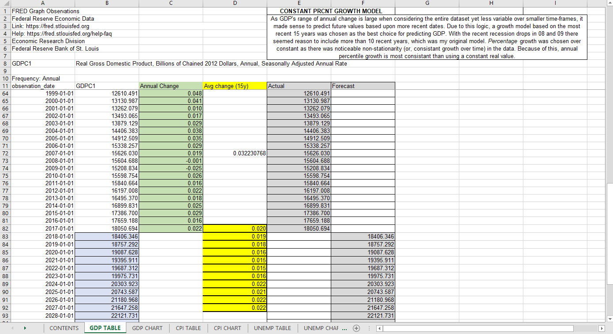
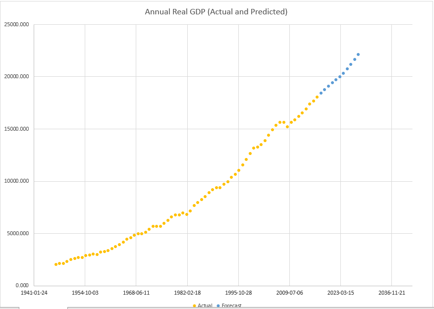
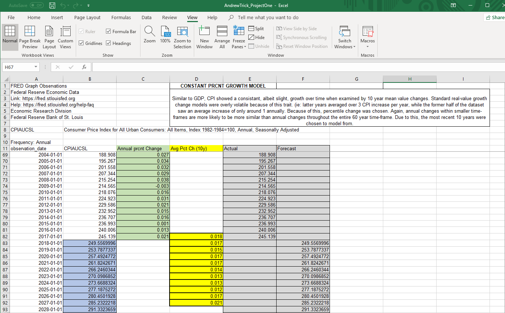
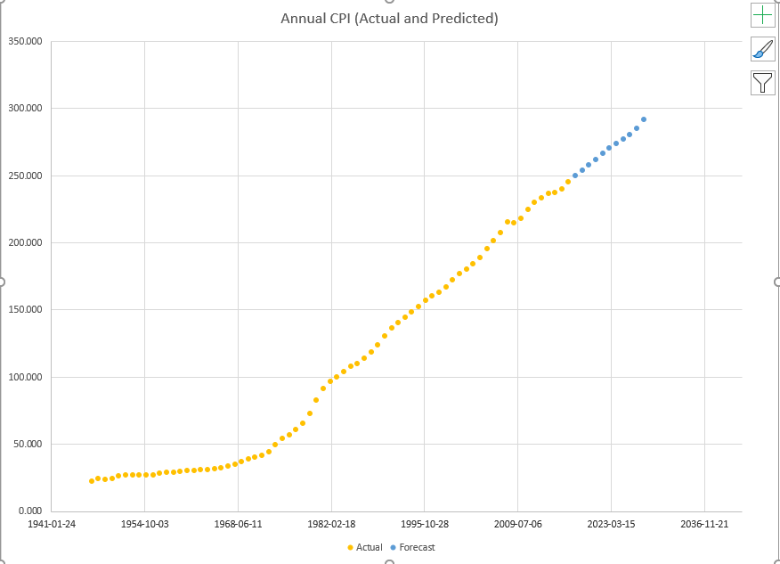
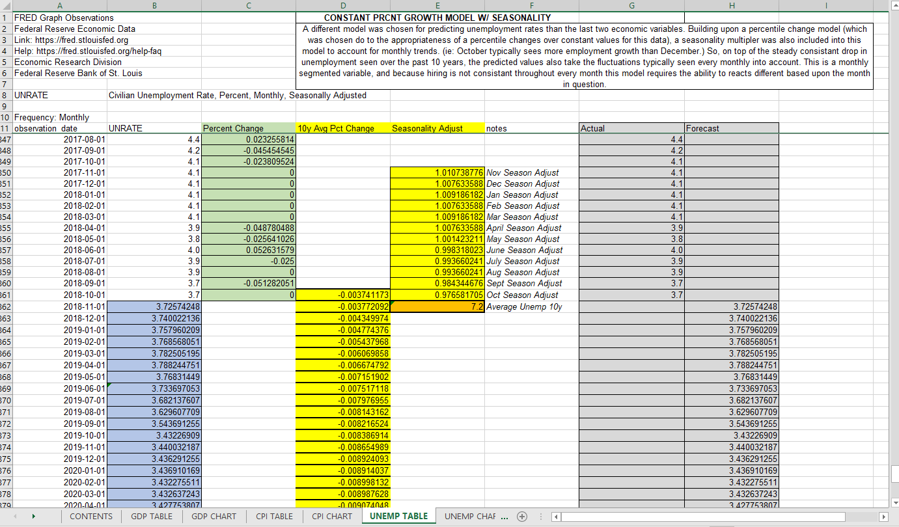
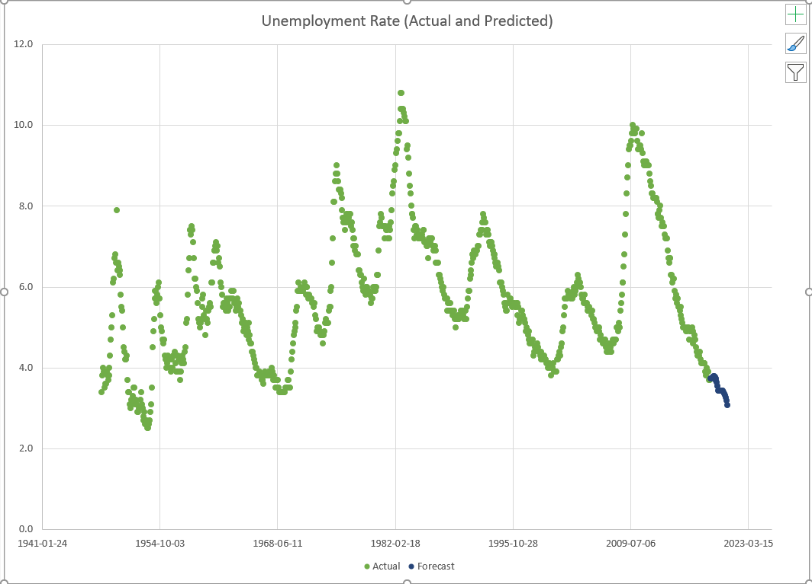
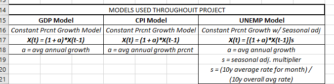

Title: Forecasting Economic Time-Series Variables in Excel
Slug: excel_econ_forecasts
Date: 2018-11-24 15:00
Category: Exploratory Data Analysis
Tags: visualizing, time series, excel, modeling, economics, forecasting
author: Andrew Trick
Summary: I grabbed some economic data from FRED and attempt to forecast future values for each variable using Excel. Econ variables of focus for this project include GDP, CPI, and the unemployment rate for the U.S. This was originally done for my Macro-econometrics class and provided me some nice time with Excel which I admittedly use too little.

# Exploring Time Series Forecasting in Excel for Economic Data
 
I grab some economic data from FRED and attempt to forecast future values for each variable using Excel. Econ variables of focus for this project include GDP, CPI, and the unemployment rate for the U.S. This was originally done for my Macro-econometrics class and provided me some nice time with Excel which I admittedly use too little.
 
Each of the models were relatively simple. The main goal was to find an accurate depiction of what the next few cycles would look like for each variable. GDP and CPI were explored via annual increments while unemployment data was looked at by monthly values. While GDP and CPI were straight-forward, the unemployment rate was interesting to work with and find a way to accurately account for seasonality.  
 
## Gross Domestic Product
First up is GDP. As mentioned, this is at an annual interval and the model is relatively simple. I opted to work with percentile yearly change differentials over constant real values because of the noticeable non-stationarity when exploring the aggregate 10 year change averages. In the end, I ended up using a 15-year moving average percentile growth model. I originally attempted a 10 year version of this but I felt the 08-09 drop due to the recession was overly influential on such a small time frame. 
  
&nbsp;&nbsp;&nbsp;&nbsp;&nbsp;&nbsp;
  
&nbsp;&nbsp;&nbsp;&nbsp;&nbsp;&nbsp;
  

## Consumer Price Index
This model process was almost identical to the GDP one above. I'll spare the details as it was simply a matter of checking for stationarity, setting the percentile change function and then averaging (windowed averages) in the growth model. The precise formula I used is listed at the end of this post.
  
&nbsp;&nbsp;&nbsp;&nbsp;&nbsp;&nbsp;
  
&nbsp;&nbsp;&nbsp;&nbsp;&nbsp;&nbsp;
  

## Unemployment Rate
This last model process was a little more interesting. While this one also called for a percentile over constant real value growth (or decline in this case), there was also the issue of seasonality. To account for the monthly up and down cycles of employment seen every year I thought the best route would be to add a season multiplier into the equation. I ran a normal 10-year moving average percentile change model with multiplier value based on the month. This seasonality multiplier was figured by dividing the 10 year month's average over the aggregate 10 year average. In this way, I could get a 1.02 multipler for one month and a 0.98 for another- indicating the average change this month sees typically compared to the overall average. While definately not a perfect model, I think it does decently well for something done quickly in excel. 
  
&nbsp;&nbsp;&nbsp;&nbsp;&nbsp;&nbsp;
  
&nbsp;&nbsp;&nbsp;&nbsp;&nbsp;&nbsp;
  

## Models

So I'll end this post with the actual formulas I ended up using for each variable. Simple and overly generalized, I'd argue they do well to estimate the near future for these econ variables. While tossing this data into Python and running sklearn on them would undoubtedly uncover better models for predicting future values, I thought this was not only great practice in Excel, but also forced me to do more of the underlying reasoning and math myself- which I found quite enjoyable.
  
&nbsp;&nbsp;&nbsp;&nbsp;&nbsp;&nbsp;
  

-Andy