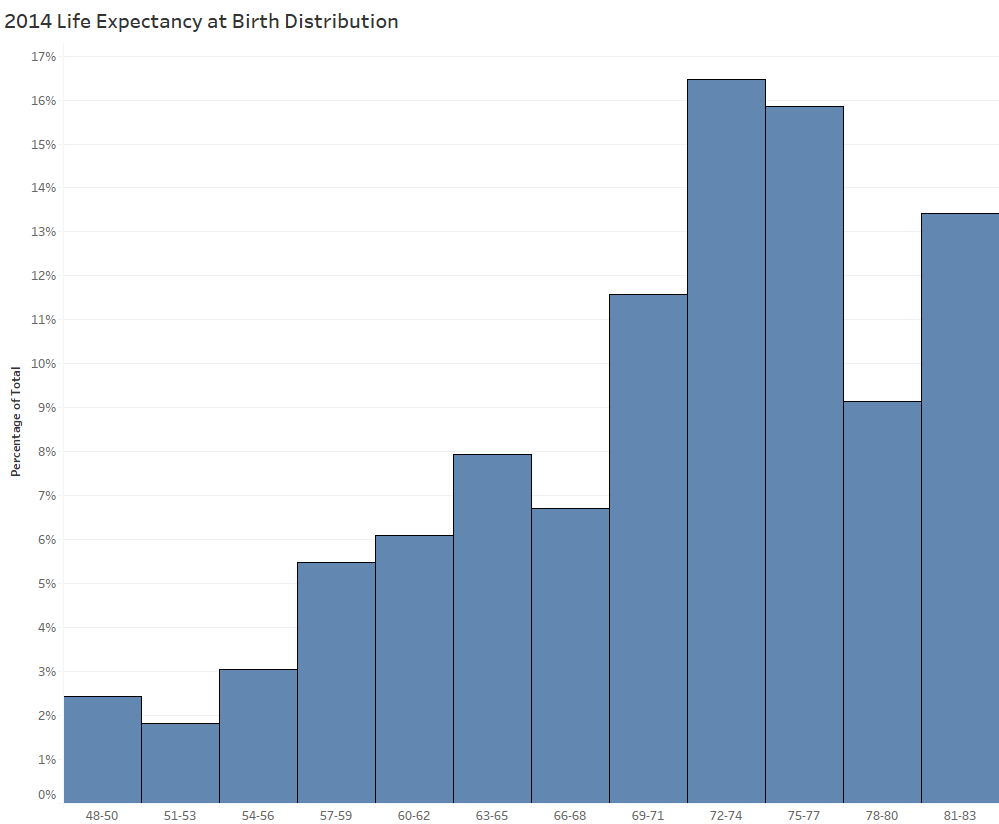
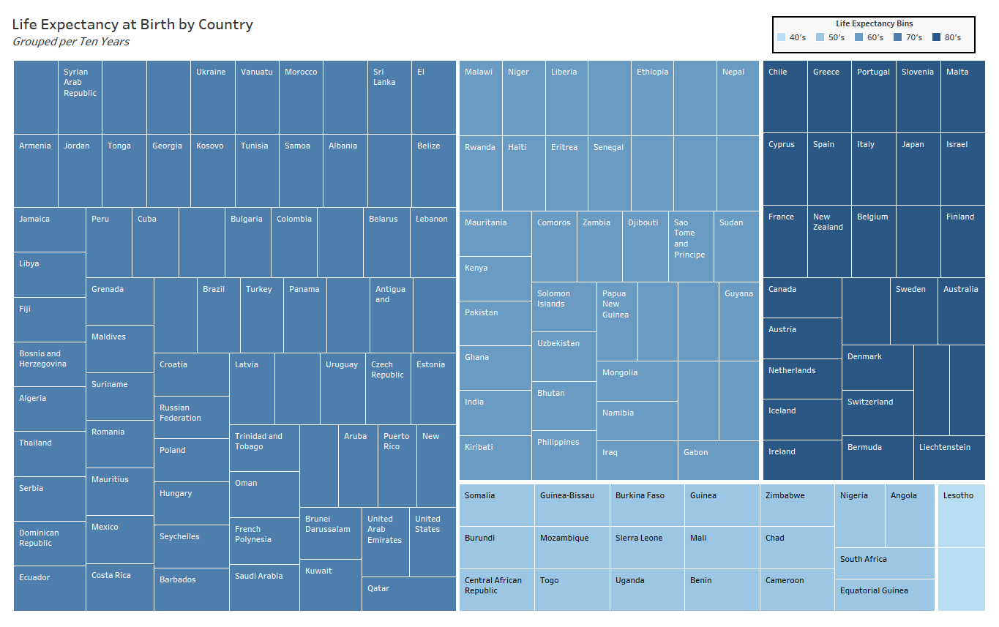
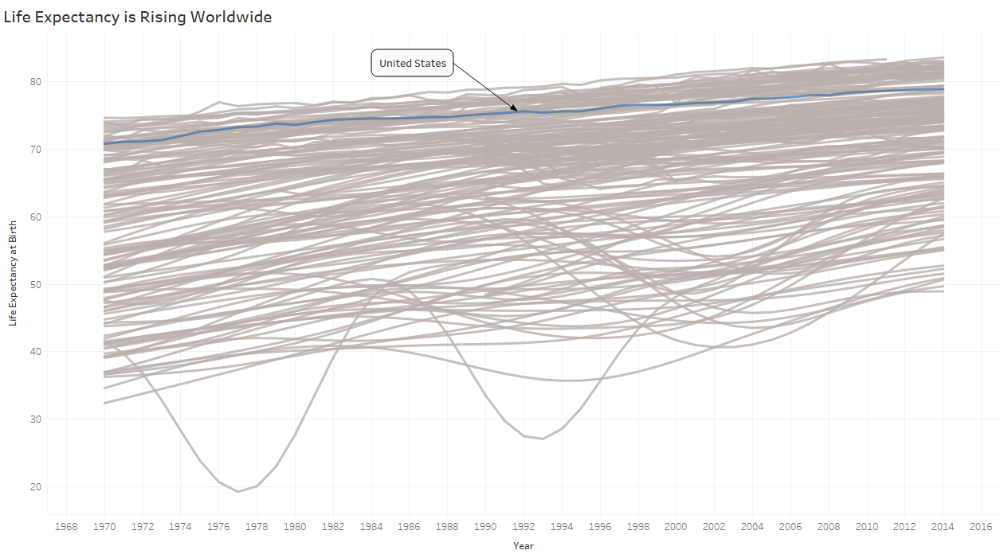
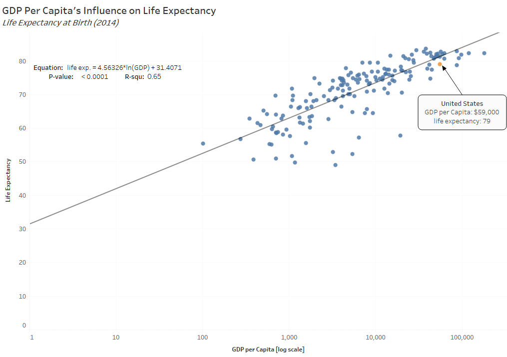
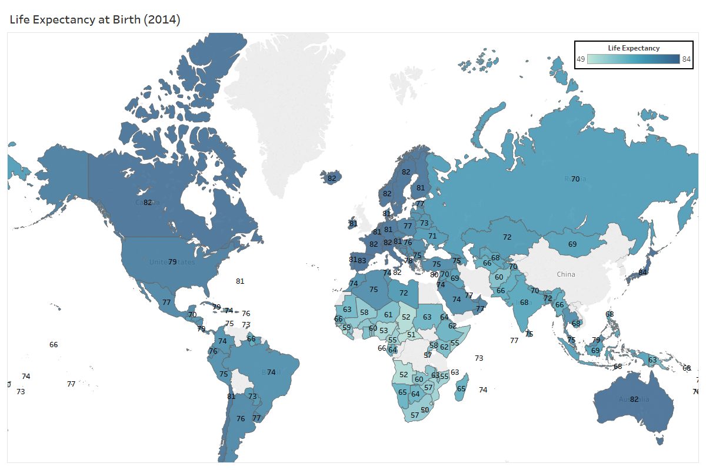

Title: Quick Life-Expectancy Visualizations
Slug: life_expectancy
Date: 2018-06-05 14:00
Category: Data Visualization
Tags: EDA, visualizing, Tableau, reporting
author: Andrew Trick
Summary: A few visuals I created in Tableau displaying some trends in life expectancy by country. Data was sources from the World Bank Open Data website and includes life expectancy at birth of around 200 countries from between 1968 and 2014. Originally conducted for SNHU Data Visualization homework assignment in which to express data in five different method classifications: comparison, hierarchical, temporal, correlation, and geo-spatial. 

# Life Expectancy Exploration and Visualization

A few visuals I created in Tableau displaying some trends in life expectancy by country. Data was sources from the World Bank Open Data website and includes life expectancy at birth of around 200 countries from between 1968 and 2014. Originally conducted for SNHU Data Visualization homework assignment in which to express data in five different method classifications: comparison, hierarchical, temporal, correlation, and geo-spatial. 

&nbsp;&nbsp;&nbsp;&nbsp;&nbsp;&nbsp;
 
**Comparison:** Quick histogram of life expectancy of countries. I decided to set bin size to 3 as it felt a gave a good display of distribution levels without making bins too specific or too vague.
  

 
&nbsp;&nbsp;&nbsp;&nbsp;&nbsp;&nbsp;
 
**Hierarchical:** Treemap showing how each country falls within life expectancy splits (split by 40-50, 50-60, ..., 80-90).
  

 
&nbsp;&nbsp;&nbsp;&nbsp;&nbsp;&nbsp;
 
**Temporal:** Line chart displaying life expectancy changes over time.. I opted to leave all countries in and grey them out to express an idea of the overall trend for all the data. US is highlighted to give a view of a specific choice as selectable in Tableau.
  

 
&nbsp;&nbsp;&nbsp;&nbsp;&nbsp;&nbsp;
 
**Relationship:** Scatter plot showing the relationship between gdp per capita and life expectancy. Logging the scale of GDP put this into a nice and linear correlation. I added the trend line just for fun to see how effective solely GDP is at explaining the variance of life expectancy. While this indicates a .65 R-squ, I'd argue from past explorations in country indicators that these have numerous other indicators in common and that some of these go to explain this variance over solely the difference in GDP.
  

 
&nbsp;&nbsp;&nbsp;&nbsp;&nbsp;&nbsp;
 
**Geo-spatial:** Lastly, a choropleth of life expectancy per country. Nothing surprising or too exciting here.
  