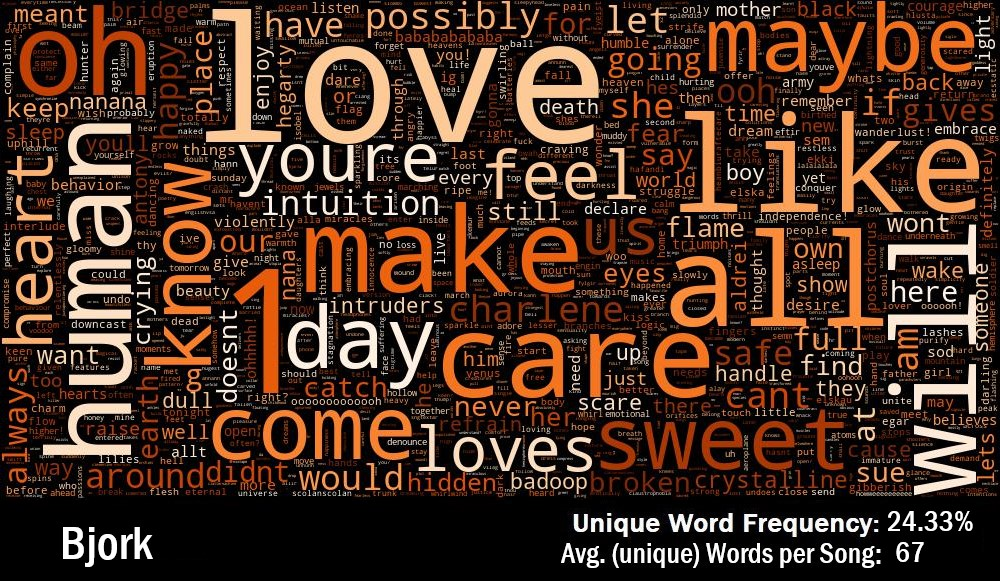

Title: Lyric Analysis
Slug: Lyrics
Date: 2018-07-02 15:00
Category: Data Visualization
Tags: visualizing, Python, NLP, word_cloud
author: Andrew Trick
Summary: An assortment of word clouds I made from lyrics I scraped for a school project. Size of each word is relative to frequency of usage by the artist in (up to) 150 of their most recent songs. Mount Eerie references nature a lot while Aesop Rock just references A LOT of things. Harry and the Potters, well... .

Inspired a bit by Pudding.cool and the great API from genius.com, I wrote some Python code to which, once asking for an artist, pulls the lyrics of 150 of their more 'popular' songs. Popular in terms of 'genius.com' user likes. This first py file conducts this search and stores the data in a csv containing only the song titles and their lyrics. 
  
The second phase of this project was to pull the stored data into another python file and form a word cloud from it. Thankfully, the actually visualization was pretty easy thanks to the wordcloud library. The tedious part was using nltk to stem and process the words of the lyrics. This included removing typical stopwords from the file (and the artist's name as well). Additionally, I wrote manual cocde to remove the punctuation and any other issues which arose.

 
I'm going to be lazy and not include the code on this page- I'd rather just focus on the final results which were the visuals. Feel free to link over to my github to see the full code though!
  

So, Here are the resulting woord clouds:

 
&nbsp;&nbsp;&nbsp;&nbsp;&nbsp;&nbsp;
  

 
&nbsp;&nbsp;&nbsp;&nbsp;&nbsp;&nbsp;
  

 
&nbsp;&nbsp;&nbsp;&nbsp;&nbsp;&nbsp;
  

 
&nbsp;&nbsp;&nbsp;&nbsp;&nbsp;&nbsp;
  

 
&nbsp;&nbsp;&nbsp;&nbsp;&nbsp;&nbsp;
  

 
&nbsp;&nbsp;&nbsp;&nbsp;&nbsp;&nbsp;
  

 
&nbsp;&nbsp;&nbsp;&nbsp;&nbsp;&nbsp;
  

 
&nbsp;&nbsp;&nbsp;&nbsp;&nbsp;&nbsp;
  

I'm pretty happy with how these turned out!  And what's nice is that it takes only about 3 minutes to run both python files and form a new cloud of any other artist sought.