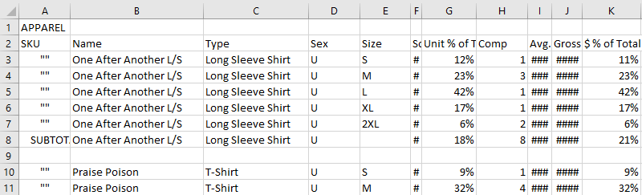
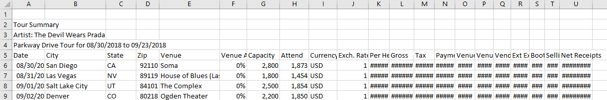
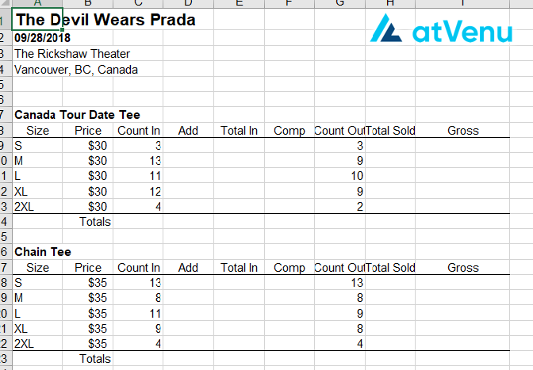

Date: 2018-10-13 08:53 
Author: Andrew Trick 
Title: Merchandise Analysis Project (Part I)
Name: Merchandise Analysis Project (Part I)
Category: exploratory data analysis
Tags: sourcing, cleaning, python, pandas, collection,
Summary: Project to aggregate and analyze merchandise sales data for my band, TDWP. Overall goals are to develop a forecasting model to predict future sales volumes and to identify patterns with which to facilitate future design decisions. This post is a description of the first steps taken of this project- reolving primarily around: sourcing and collecting the data, methods of aggregating and combining the disparate dataset, and cleaning of the data into a relation format. This depicts the process from first steps to DB uploading.

# Merchandise Analysis Project (Part I)
Project to aggregate and analyze merchandise sales data for my band, TDWP. Overall goals are to develop
a forecasting model to predict future sales volumes and to identify patterns with which to facilitate 
future design decisions. This post is a description of the first steps taken of this project- reolving 
primarily around: sourcing and collecting the data, methods of aggregating and combining the disparate 
dataset, and cleaning of the data into a relation format. This depicts the process from first steps to DB 
uploading.
 <br>

## Goals

```
1 - Collect and aggregate unit sales of tour merchandise into a mySQL database.
2 - Analyze historic sales trends to forecast sales and enhance stock mgmt.
3 - More accurately predict merchandise sales for tour budgeting.
```
<br>
First steps- even before data collection- was to explore what this project might be able to achieve and the
reasons for conducting one such as this. As listed above, three specific and distinct benefits could be seen
from organizing and analyzing our historic merchandise sales. Brainstorming the goals like this provided not 
only an idea why this project should be attempted, but also pointed to the overall process of how the project 
should run, allowing for a vague outline of the project life-cycle.

<br>
## Overall Process
 
```
1 - Collect data (internal, scrapers, etc.)
2 - Generate features 
3 - store processed data into mySQL
4 - EDA FTW
5 - Explore models
6 - Report findings and methods of implementation
```
<br>
The process taken for this project is the typical expected for most data science work-flows. It begins with collecting
the data and ends with a final model for forecasting and visuals/reports to share and implement findings of analysis. 
A MySQL DB will be used to house the processed data- after first round feature generation- and before Exploration. While
the raw data will be stored and untouched throughout manipulation, I decided to generate a handful of obvious feaures
before storage into the DB. After this, exploration will lead to further manipulation and, eventually, a final report
indicating patterns found within the sale history. Lastly, a model will be crafted to forecast future sales for more
accurate budgeting and testing throughout the next tour. 

<br>
### Sourcing and Collecting the Data
The first step was to collect all necessary and/or useful data towards creating a system towards achieving the stated 
goals. The band has used <i>Atvenue</i> to track our sales in for the past few years, so connecting to and pulling 
historic data if our merch sales will be the primary resource. Their web portal used to access these numbers also 
provides a method of exporting the data- albeit in a method optimized for human viewing rather than any relational
or very organized format.The remainder of this post will focus on the decisions, processes, and code used to aggregate 
and clean this atvenue data into three relational formats- one for each specific goal above. 
<br>

#### Raw Data Format
###### <b>sales reports</b>
Data was exported into csv format and came in three different versions. First is 'sales reports' which display the
overall sales of each merch item for a tour. ie: the gross sales of a design and how the distribution of sales by 
size. Example head of excel view. <i>(Some columns are shortened to keep some information confidential.(/i)
&nbsp;&nbsp;&nbsp;&nbsp;&nbsp;&nbsp; 
Obviously not a great format to work with.. 

<br>
###### <b>Tour Summaries</b>
Next up are 'tour summaries'. Again, this exported in a format better for human viewing rather than what makes sense
for analyzing. Plenty of work needed to reset these into a useable format. Rather than the overall tour-wide reports
like above, these focus on the total merch sales per show of a tour- disregarding how the income was generated. This
will primarily be used for the forecasting goal listed above. 
&nbsp;&nbsp;&nbsp;&nbsp;&nbsp;&nbsp; 
Missing data abounds.

<br>
###### <b>Daily Reports</b>
Lastly from atvenue are are the 'daily reports'. By the far most difficult to use of the three given the formatting, this
revolves around per show sale counts by size. Expectedly, this will be msot useful in exploring how unit sales change based 
ongeo, tour type, season, day of week, etc. Each day was a separate spreadsheet, so work is also done to collect each of these
into one table per tour. 
&nbsp;&nbsp;&nbsp;&nbsp;&nbsp;&nbsp; 
SO moast of the table is unfilled. Manual calcuations needed to figure sales counts for some reason.

<br>
## Processing Raw Data
