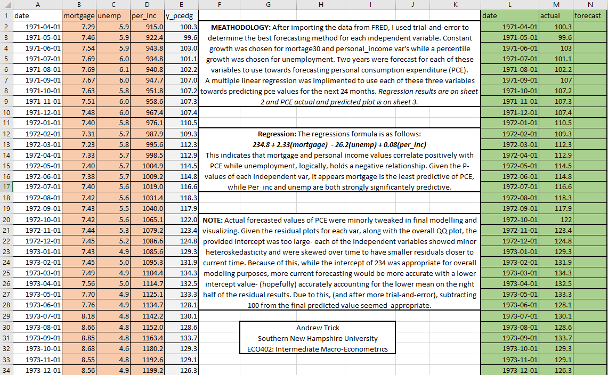
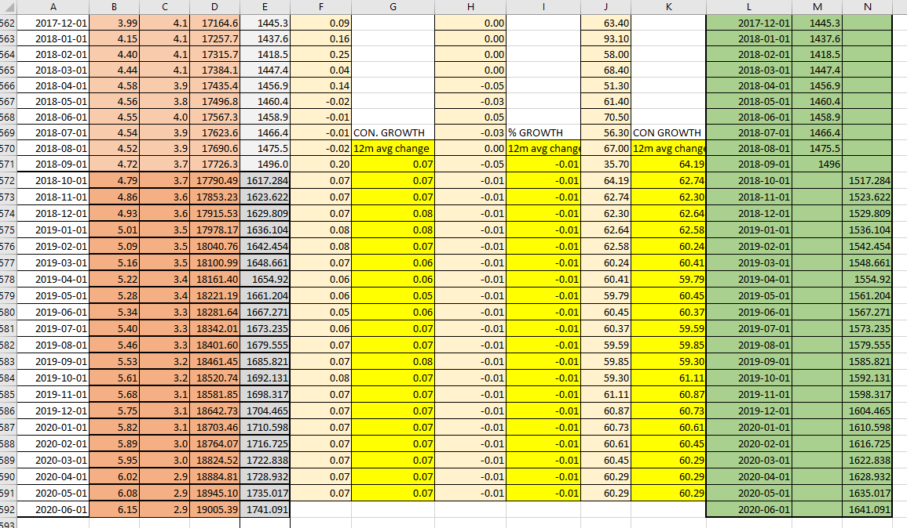
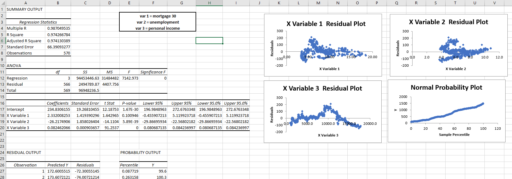
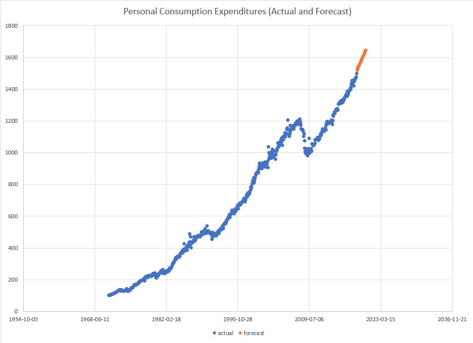

Title: Multiple Linear Regression to Predict Consumer Spending
Slug: excel_mult_regression
Date: 2018-12-08 15:00
Category: Machine Learning
Tags: visualizing, time series, excel, modeling, economics, forecasting, regression
author: Andrew Trick
Summary: As in the last post, here's some more work in excel with economic variables. This time I use value forecasts of 30y mortgage, unemployment, and personal income rates, figured in a similar manner as before (annual growth/change rates - 10y moving averages) to predict future levels of personal consumption expenditures. I run a multilinear regression analysis to forecast PCE based upon the three independent variables and end up with some pretty strong results and an adjusted R-squared of .974.

# Regression Analysis to Predict Personal Consumption Expenditure 
  

As in the last post, here's some more work in excel with economic variables. This time I use value forecast of 30y mortgage, unemployment, and personal income rates, figured in a similar manner as before (annual growth/change rates - 10y moving averages) to predict future levels of personal consumption expenditures. I stick with a pretty simple multilinear regression throughout this and, while exploring interactions between variables or non-linearity could have been beneficial, the linear model performed extremely well.
  
&nbsp;&nbsp;&nbsp;&nbsp;&nbsp;&nbsp;
  
As I discussed my method of forecasting economic variables in a recent post, I'll skip that step here. In quick summary, I ran a 10y moving average forecast based upon annual percent changes in each economic indicator. Below is a quick look at how the excel file looked for me after including these predictors. 
  
&nbsp;&nbsp;&nbsp;&nbsp;&nbsp;&nbsp;
  

Once each variable was forecast out I was able to use these predictions to then predict CPE. The analysis module in Excel made this step extremely simple and it was a matter of easily selecting and splitting up the training and forecasting data. The results of this are below: 
  
&nbsp;&nbsp;&nbsp;&nbsp;&nbsp;&nbsp;
  

Results show a very strong R-squared at .974. Similarly, the standard error is relatively low and the residual and Q-Q plots look pretty heteroskedastic. While I admit there does look to be some type of non-linearity in the personal income residuals, I think this model is still pretty appropriate. Lastly, the P-values of personal income and mortgage rates are both extremely low indicating a strong relationship to PCE. Unemployment sits at 0.1 and is not necessarily statistically significant. If not required for the assignment I would have explored how the model changed with the removal of this independent var.
The last step was to visualize these predictions. Looking at the trend, I'd argue these values look to be pretty accurate and reliable.
  
&nbsp;&nbsp;&nbsp;&nbsp;&nbsp;&nbsp;
  
-Andy