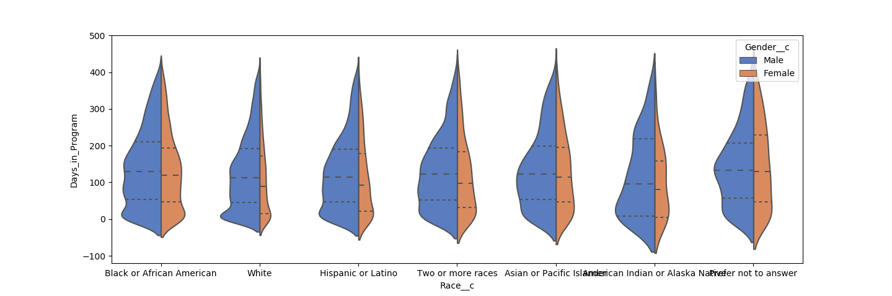
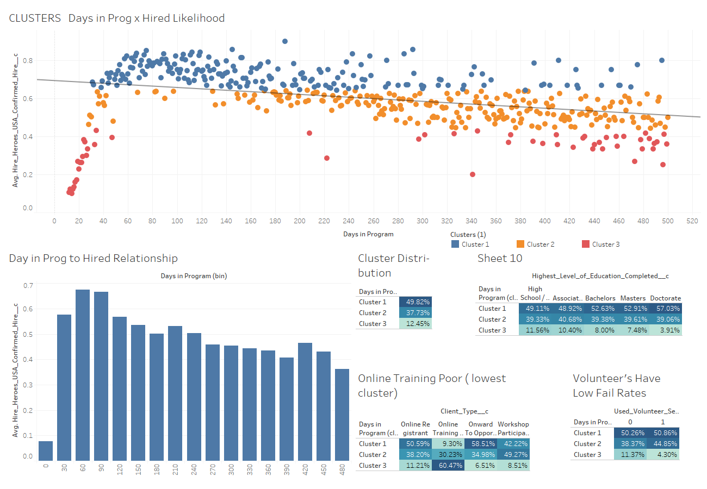
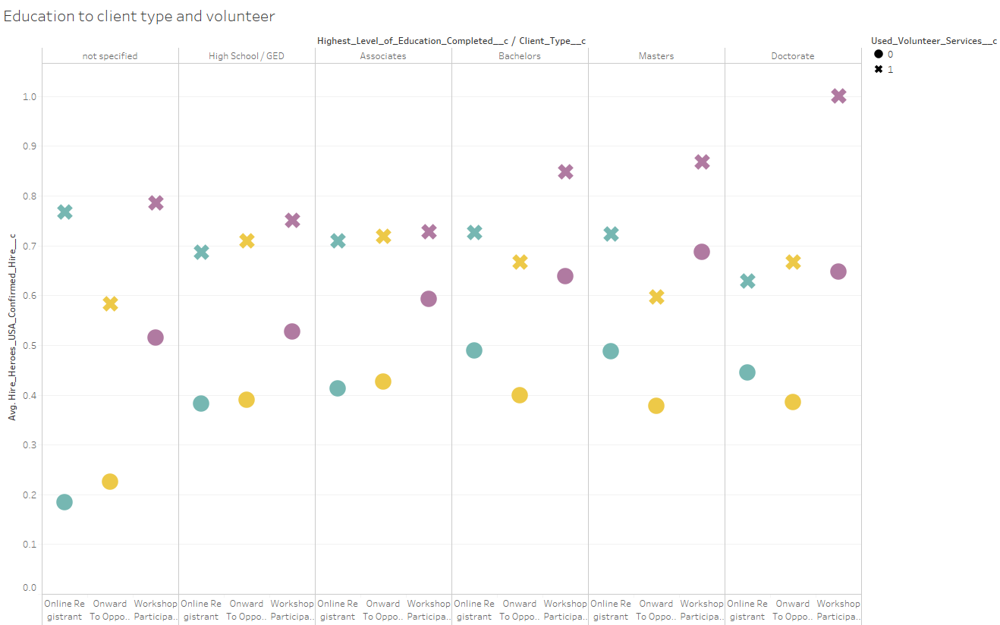
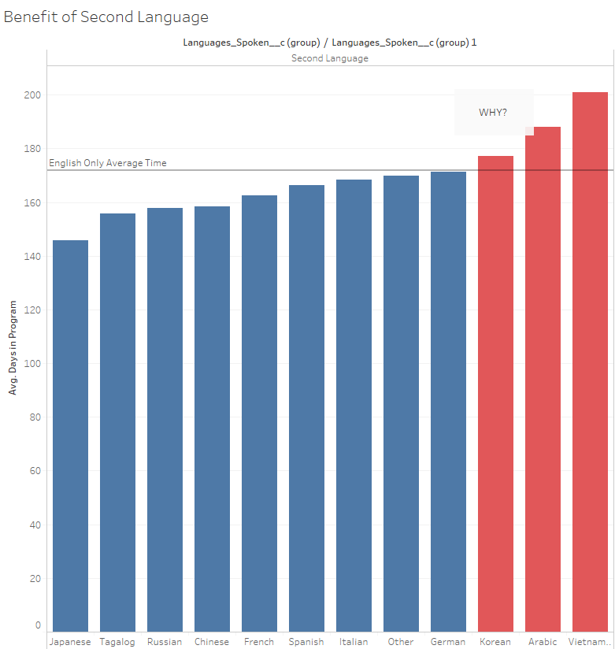
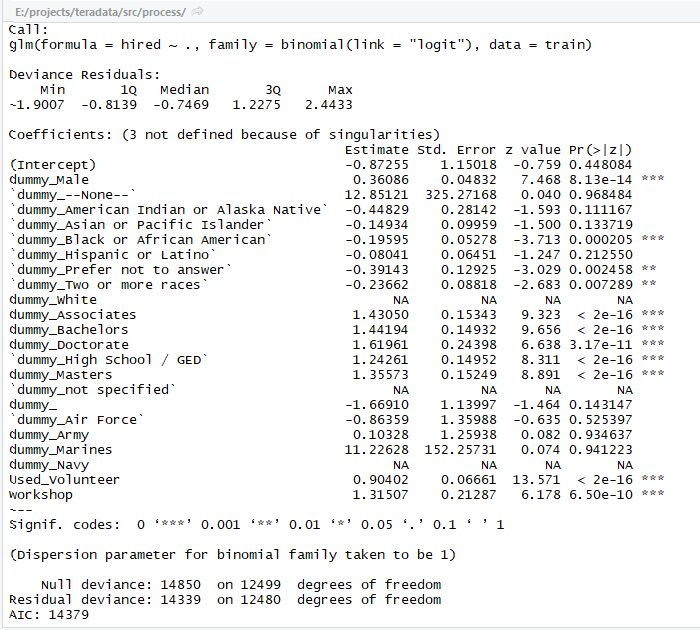
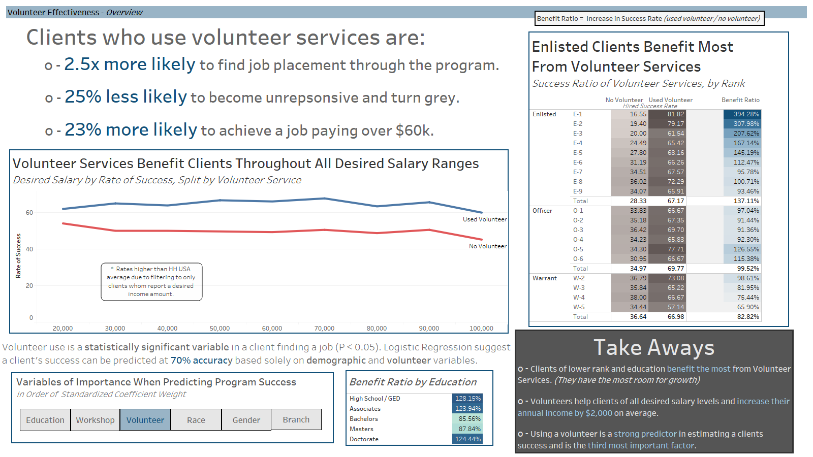
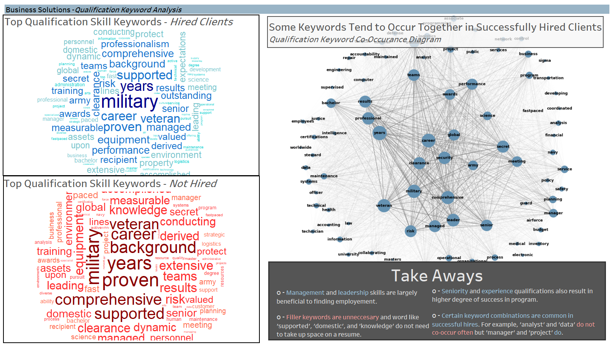
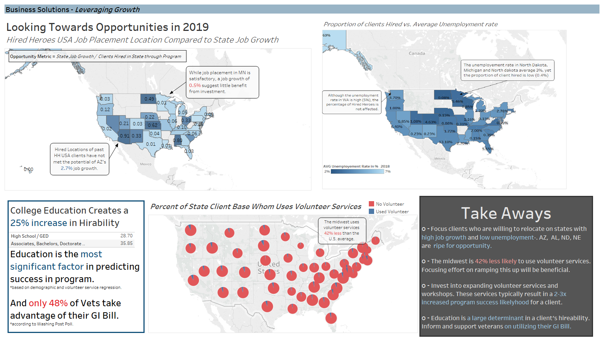

Title: 2019 TUN Data Challenge
Slug: tun_data_challenge
Date: 2019-04-27 15:30
Category: Exploratory Data Analysis
Tags: analytics, eda, R, Python, cleaning, logistic regression, tableau, collaboration
author: Andrew Trick
Summary: Brief overview of the TUN Data Challenge I conducted with a team as part of SNHU experiential learning course. We work with client, marketing, and interaction data from non-profit, Hire Heroes USA to answer business problems specified by the organization. Our process involved: Defining goals, cleaning data, exploratory data analysis, statistical analysis, data visualization, and communicating results. Final results from the contest are still pending, expected in late July.

Role: Team Lead <br>
GitHub Repo: [leaflettuce/teradata_challenge](https://github.com/leaflettuce/teradata_challenge)<br>
Teammates: [Christine Rizzo](https://www.linkedin.com/in/christinerizzo1/) and [Chris Williams](https://www.linkedin.com/in/christopher-williams-7aaa7b17b/)

# 2019 TUN Data Challenge
## TEAM DATA SNHUPERS
SNHU provided the opportunity to take an experiential learning class focused on taking part of Teradata University Network's 2019 Data Challenge. This project worked with non-profit Hire Heroes USA and provided their client, marketing, interaction, and numerous other data sets for students to analyze. The open-ended goal was to select one or two business problems proposed by HH USA and mine the data for answers. My team conducts this project in a typical data life-cycle approach: Source Data, Clean, EDA, Analyze, Model, Visualize, Communicate, and Iterate these where needed. Our final presentation leverages not only trends found in HH USA data but also external sources to provide suggestions to continued growth in the near future.
<br>
<br>NOTE: This Project Summary will be vague in regard to the data and results to ensure confidentiality of Hire Heroes USA.
<br><br>

## Background 
### Motivation
HH USA's mission is to assist US military members, veterans, and spouses to succeed in the civilian workforce. While the military has been increasing in diversity and equality throughout the years, the US hiring environment can be biased and finding ways to level the playing field can have far reaching benefits. Out team had not only an intellectual curiosity about the trends and success rate of HH USA< but also was deeply motivated to assist however possible in delivering insights to the organization which may be leveraged to create position impact for veterans and their families.
<br>
### Problem Identification
We selected two business problems from HH USA which we thought worked well together and could provide useful results for future development of the program:
```
- Is there anything in the client's demographic profile that indicates that a client is more likely to 
become a confirmed  hire or any other outcome?
- What can we prove - quantitatively - that our volunteers are increasing the overall effectiveness of 
our program?
```
A strict methodology was quintessential for the success of this project; we wanted to provide valuable and validated insights into the organization and offer actionable items that can make a difference. Furthermore, since integrity was at the forefront of our research, we made sure to create a collaborative environment with regular checkpoints that would prevent the team from working in a siloed manner.
<br><br>As a team we decided these two questions would not only provide a useful focus for mining the data, but also provide an outline for the type of story we wanted to tell. Starting from a problem- inequality in hiring success- we could discuss challenged faced by the program and how the program's volunteering services succeed (or not) in alleviating these issues. 
<br><br>

## Processing and Exploring 
### Data Cleaning
With the problem defines and data sourced, the next step was to organize and clean the data to appropriately prepare for analytics. This was a collaborative and iterative process in which we created a backlog of problem areas and systematically worked through each issue. Much of the cleaning was conducted by myself and the other SNHU team's lead [Mitch Beckner](https://www.linkedin.com/in/mitchell-beckner-5028ab8b/). 
<br><br>After mapping out the data set relation model, we connected data sets and cleaned up each column of interest. Many of these were free-form entries which required excessive processing. Below is one example which cleans the education variable. We ended with over 1,000 lines of R code developed to clean the data:
```
clean_education <- function(x) {
  x <- tolower(as.character(x))
  if (grepl('4', x) | grepl('bach', x) | grepl('ba', x) | grepl('bs', x)) {
    'Bachelors'
  }
  else if (grepl('2', x) | grepl('asso', x) | grepl('aa', x) | grepl('as', x)) {
    'Associates'
  }
  else if (grepl('post', x) | grepl('master', x) | grepl('ma', x) | grepl('ms', x)) {
    'Masters'
  }
  else if (grepl('doct', x) | grepl('phd', x) | grepl('md', x)) {
    'Doctorate'
  }
  else if (grepl('some', x)) {
    'Some College'
  }
  else if (grepl('ged', x) | grepl('high', x)) {
    'High School / GED'
  }
  else {
    'not specified'
  }
}

df_contact$Highest_Level_of_Education_Completed__c <- lapply(as.character(df_contact$Highest_Level_of_Education_Completed__c), clean_education)
df_contact$Highest_Level_of_Education_Completed__c <- as.factor(unlist(df_contact$Highest_Level_of_Education_Completed__c))
```
plyr, tidyverse, and lubridate were the primary libraries used to cleanse the data. Outside of cleaning we also set types, dealt with missing data as determined appropriate, and generated features. One important example of feature generate was the creation of a variable which specifies the time a client was in the program. The route to figuring this was collaboratively worked through within a github issue [forum](https://github.com/leaflettuce/teradata_challenge/issues/9).
<br>
### Finding Trends
After data was processed my team worked through focused Exploratory Data Analysis. This revolved around identifying interesting and useful trends and outliers in the data. Rather than any deep dives, this first analyses main goal was to get a better understanding the the data and identify areas to spend more time on.
<br><br>A few examples of the EDA I performed, primarily done in Python/Seaborn and Tableau:
<br>&nbsp;&nbsp;&nbsp;&nbsp;&nbsp;&nbsp;<br>
<br>&nbsp;&nbsp;&nbsp;&nbsp;&nbsp;&nbsp;<br>
<br>&nbsp;&nbsp;&nbsp;&nbsp;&nbsp;&nbsp;<br>
<br>&nbsp;&nbsp;&nbsp;&nbsp;&nbsp;&nbsp;<br>
<br>
### Modeling
Some machine learning modeling was also run to attempt to predict the likelihood of a client successfully find work throughout the program. While a teammate Christine worked with Naive Bayes, I prepped the data and trained a logistic regression model with demographic data as input. Each input variable was dummied out and the entire input matrix consisted of binary variables. Final results of this model were better than expected and though only a 8 demographic factors a client's success could be predicted at 70% accuracy:
<br>&nbsp;&nbsp;&nbsp;&nbsp;&nbsp;&nbsp;<br>
<br>&nbsp;&nbsp;&nbsp;&nbsp;&nbsp;&nbsp;<br>
<br>
## Results and Visualizing 
### Findings
As mentioned any specific findings will be avoided here. The analysis was successful in identifying inequalities found in hiring success based upon demographic characteristics. Additionally, the team was able to quantify the effectiveness of the volunteering services of the program.
<br><br>We also sourced external data from BLS, Census, Dept of VA, and DoD to add to the report. We leveraged this third-party data to provide context to the trends and to suggest avenues of further growth for the company. 
<br>
### Visualizing Results
Visualization of the results was a very iterative process. Roughs were created and evaluated with the team to decide on what was best suited for conveying specific findings. 90% of the visualization was done in Tableau. R was used to create a wordcloud while Python w/ networkX library was used to form a co-occurrence network diagram.
<br><br>These visualizations were they collected onto dashboards- each with a specific purpose- and then converted onto PP slides for final presentation. A few ezamples of the slides:
<br>&nbsp;&nbsp;&nbsp;&nbsp;&nbsp;&nbsp;<br>
<br>&nbsp;&nbsp;&nbsp;&nbsp;&nbsp;&nbsp;<br>
<br>&nbsp;&nbsp;&nbsp;&nbsp;&nbsp;&nbsp;<br>
<br>
## Overall Considerations
### Personal Benefits
This project was extremely valuable for several reasons to my personal development. Firstly, I have worked throughout the data life-cycle like this before, but this was a first in collaborating with teammates throughout the entire process. It gave insight into tactics for collaborative problem solving and working with others in the field; I have a much better understanding of how to work in an Agile environment. My time management skills have also benefited from this course thanks to the short time-frame of the project.
<br><br>Taking on the team lead also gave me great experience of organizing and directing a project such as this. I established milestones, listed KanBan and Github tasks, and generally kept the project organized and scheduled on a time-line. Beyond the project management skills this inherently included I also developed a sense of how to ensure integrity and accuracy throughout an analysis project- a key requirement for any statistical work. I also took charge of the cloud storage and sharing solutions for the team by maintaining the GitHub repo and organizing the shared directories for the project.
<br><br>Finally, this project also helped develop my technical skills in cleaning in R and visualizing in Tableau. I have had plenty of experience with both, yet this experience gave me even more practical use. It also gave me further insight into how to create an informative and interesting PowerPoint presentation for data communications.
<br>
### Final Considerations
In final review of the project there are, as always, several areas I would like to spend more time. I believe some of the slides could be further refines and, if anything, reduced to focus on fewer visuals. I think the presentation is insightful and interesting yet extremely deep and difficult to convey in the 7 minutes that will be provided if we are invited to the Teradata converence as finalist. More external data sources could also provide useful analysis on how to further develop the program. Exit survey data of clients in the HH USA program could show key areas that need refinement or which are working well.
<br><br>Overall, I am excited about the final presenation my team wwas able to create and look forward to seeing how we place in the challenge.
<br>
### Final Results
Still Pending: Teradata will judge submissions and list finalist in late July.