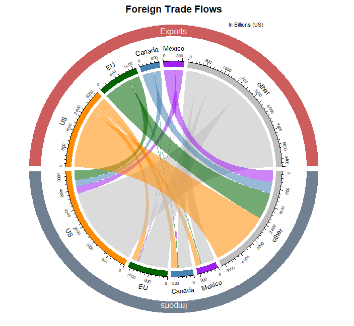

Title: Foreign Trade Flows (Chord Diagram)
Slug: trade_flows
Date: 2018-06-02 14:00
Category: Data Visualization
Tags: visualizing, R, reporting
author: Andrew Trick
Summary: In honor of the looming trade war, here's a diagram I made which displays how much money changed hands in trade between the US, EU, Canada, and Mexico in 2016. While it may look like a relatively small portion of the aggregate total trade, thats still a lot of money.
#Trade Flows

In honor of the looming trade war, here's a diagram I made which displays how much money changed hands in trade between the US, EU, Canada, and Mexico in 2016. While it may look like a relatively small portion of the aggregate total trade, thats still a lot of money.

&nbsp;&nbsp;&nbsp;&nbsp;&nbsp;&nbsp;
  
So the main reason for this visual was to give a chord diagram a try in R. I utilized the circlize library which made this a more-or-less painless process. I wasn't a fan of how it originally displayed imports and exports in the same country category section, so i manipulated the data and code to split these variables. The outcome is a weird mixture of a chord and sankey chart. Hopefully not too confusing.